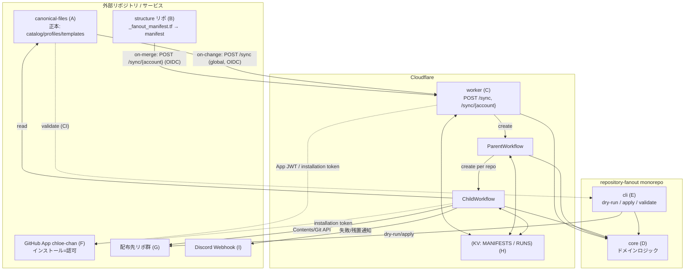
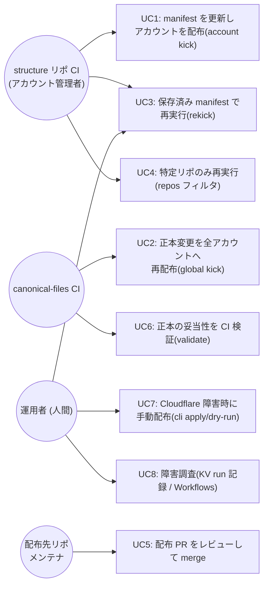
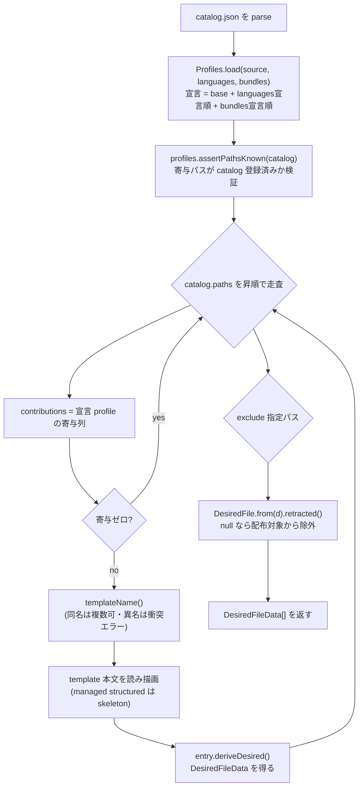
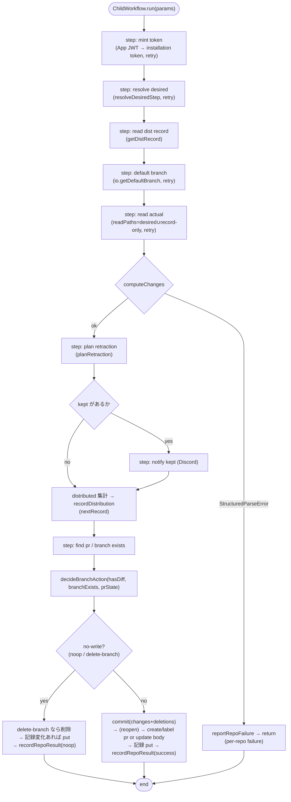
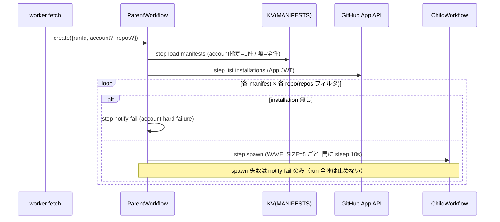
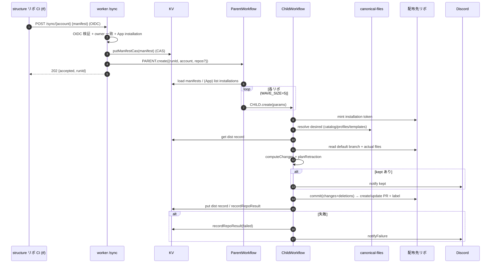
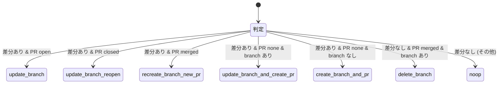

# repository-fanout 現行仕様書（AS-IS Specification）

> 作成日: 2026-07-06 / 対象コミット: `724bc40`（origin/main）
> 本書はリファクタリング前の**現行実装を正本**として記述する。出典はすべて実コード（`packages/core` / `apps/worker` / `apps/cli`）であり、過去の設計ドキュメント（`docs/superpowers/specs`）や memory に対して**コードが食い違う場合はコードを正とする**。
> 例: 過去メモに `SYNC_HMAC_SECRET`（HMAC 認証）の記述があるが、**現行は GitHub Actions OIDC 認証**（`apps/worker/src/auth/oidc.ts`）。本書は OIDC を正とする。

---

## 0. 本書の目的

LLM による実装で繰り返された「局所調査・stale 前提・勝手なスコープ切り」を防ぐため、システムの全体像・境界・データ・エンドポイント・KV スキーマ・戦略の意味論を**網羅的**に固定する。以降のリファクタリングは本書を基準に差分を語る。

---

## 1. システム全体像

### 1.1 一言でいうと

**「正本リポジトリ（canonical-files）に置いた共通ファイルを、宣言（manifest）に従って多数のリポジトリへ PR として配布し、継続的に収束させる」宣言的ファイル配布システム。**

- 配布は「正本の内容へ寄せる」だけでなく「正本から消えた／除外された寄与を配布先からも取り消す（削除追従 = retraction）」までを含む宣言的収束。
- 実行主体は Cloudflare Workers + Workflows。認可の実体は GitHub App（`chloe-chan`）のインストール。
- 人間は配布 PR をレビューして merge する（fanout は提案するだけ・force 変更しない）。

### 1.2 登場コンポーネント（このリポジトリの内外）

| # | 名前 | 所在 | 役割 |
|---|---|---|---|
| A | **canonical-files** | 外部リポ `bright-room/canonical-files` | 配布する共通ファイルの**正本**。`catalog.json` / `profiles/` / `templates/` を持つ（後述 §12） |
| B | **structure リポ** | 外部リポ（`bright-room/organization-structure`, `kukv/structure` 等） | 各アカウントの配布**宣言（manifest）の生成元**。Terraform の `_fanout_manifest.tf` で組み立て、CI（on-merge）が `/sync` を叩く |
| C | **worker（本体）** | `apps/worker` | Cloudflare Worker。`/sync` エンドポイント + Workflows（parent/child）。**配布の実行主体** |
| D | **core** | `packages/core` | ドメインロジック（配布戦略・差分・削除追従・manifest・GitHub API・OIDC 以外の認証部品）。worker と cli が共有 |
| E | **cli** | `apps/cli` | 最後の砦（Cloudflare 全面障害時の手動配布）＋ 正本の CI 検証（`validate`）。core を worker と同じく使う |
| F | **GitHub App `chloe-chan`** | GitHub | 配布先リポへの書き込み権限の実体。インストール = 認可 |
| G | **配布先リポ（target）** | 各アカウントの多数のリポ | 配布 PR を受け取る側。manifest の `repositories` に列挙されたリポ |
| H | **Cloudflare KV** | Cloudflare | manifest / 配布記録 / run 結果の永続化（§8） |
| I | **Discord Webhook** | 外部 | 失敗・残置ファイルの通知先（任意） |

> **境界の明示**: 本リポジトリ（repository-fanout）に含まれるのは **C/D/E** のみ。manifest の生成（B）・`/sync` を叩く CI（B/A）・GitHub App の定義（F）・配布先（G）は**すべて外部**。本書はそれらとの**契約（POST body・OIDC claim・PR の形）**を規定する。

### 1.3 コンポーネント図



---

## 2. 用語集

| 用語 | 定義 |
|---|---|
| **正本 / canonical** | canonical-files リポの中身。配布の source of truth |
| **catalog** | `catalog.json`。配布しうる全パスと各パスの `file_type` / `mode`（戦略）を宣言（§5, §12.1） |
| **profile** | `profiles/{name}/contributes.json`。あるパスへの寄与（データ・テンプレ指定）。`base` は常に選択、`languages`/`bundles` は宣言で選択 |
| **contribution / 寄与** | 1 profile が 1 パスに与えるデータ（`{ template?, ...データ }`） |
| **manifest** | あるアカウントの配布宣言（`repositories` ごとに `languages/bundles/contents/exclude`）（§8.1, §11） |
| **desired（望ましい状態）** | catalog×宣言 profile から導出した「各配布先パスがどうあるべきか」（§6） |
| **strategy（戦略）** | パスをどう配布・収束させるか（replace / create-only / managed-block / structured-managed）（§5） |
| **reconcile** | 1 リポについて desired と実ファイルを突き合わせ、差分を PR にし、削除追従まで行う一連（§7） |
| **retraction / 削除追従** | 正本から消えた・exclude された寄与を配布先からも取り消すこと（§9） |
| **dist record（配布記録）** | 「fanout がそのファイルを配った」証拠（strategy とハッシュ履歴）。削除追従の安全弁（§8.2, §9） |
| **managed block** | テキストファイル内の `# >>> repository-fanout managed >>>` … `# <<< ... <<<` で囲む fanout 管理領域 |
| **managed_paths** | 構造化ファイル（json/yaml/toml）の特定トップレベルキーだけを管理する指定（§5.4） |
| **universe** | 「全 profile（選択有無を問わない）が寄与しうるエントリ/キーの集合」。リポ独自エントリと fanout 由来エントリを区別する境界（§9） |
| **exclude** | あるリポで特定パスを fanout 管理外にする宣言（寄与ゼロへ収束させる or 管理を引き渡す）（§9） |
| **contents** | リポ個別値（`{{ contents.codeowner }}` 等でテンプレに注入）。旧名 `vars`（§10.2 の命名の歪みに注意） |
| **kick** | `/sync` で reconcile を起動すること。account kick / global kick の2種 |
| **run** | 1 回の kick に対応する実行。`runId`（UUID）で識別。リポ単位結果を KV に残す |

---

## 3. ユースケース

### 3.1 ユースケース図



### 3.2 ユースケース一覧

| UC | 主アクター | トリガ | 成功条件 | 出典 |
|---|---|---|---|---|
| UC1 account kick | structure CI | structure リポの PR merge（on-merge が apply 後 manifest を POST） | manifest 保存＋対象リポに配布 PR（差分あれば） | `index.ts` L79-141 / runbook §7 |
| UC2 global kick | canonical-files CI | 正本変更 merge → `POST /sync`（body 無し） | 全アカウント・全リポを reconcile | `index.ts` L66-77 / runbook §1 |
| UC3 rekick | 運用者 | `gh workflow run fanout-rekick.yml` | 保存済み manifest で再 reconcile | runbook §1 |
| UC4 部分再実行 | 運用者 | rekick に `-f repos=a,b` | 指定リポのみ reconcile | `index.ts` `parseRepos` / `parent.ts` L67 |
| UC5 PR レビュー | 配布先メンテナ | 配布 PR 発生 | 人間が全ファイル目視で merge | runbook §7-4 |
| UC6 validate | canonical-files CI | 正本の PR | 全 profile 組合せの描画が通り、描画後 YAML が構造検証を通る | `validateDir.ts` |
| UC7 手動配布 | 運用者 | Cloudflare 障害 | 1 リポに追加・更新のみ配布（削除追従なし） | `cli/index.ts` / runbook §4 |
| UC8 障害調査 | 運用者 | 失敗通知・調査依頼 | run 記録・Workflows 実行状態から原因特定 | runbook §2 |

---

## 4. アーキテクチャ（現行）

### 4.1 モノレポ構成

pnpm workspace（`packages/*`, `apps/*`）。TypeScript ESM。

```
packages/
  core/         ← ドメインロジック（worker/cli 共有）※唯一の実ロジック層
  tsconfig/     ← 共有 tsconfig（base.json）
apps/
  worker/       ← Cloudflare Worker（HTTP + Workflows）
  cli/          ← Node CLI（tsx 実行）
```

- ビルドは無し（`main` が `.ts` を直接指す）。worker は wrangler、cli は tsx が TS を直接実行。型検査は `tsc --noEmit`。
- 依存の向き: `apps/worker` → `@repository-fanout/core`、`apps/cli` → `@repository-fanout/core`。core は app に依存しない。

### 4.2 core の層構造（既に DDD 風。ただし不完全）

```
packages/core/src/
  index.ts                         ← 公開バレル（全 export の唯一の窓口）
  domain/
    model/
      canonical/                   ← 正本モデル（集約）
        catalog.ts / catalogEntry.ts / contribution.ts / profiles.ts
        template.ts / templateSource.ts(★port インタフェース)
      desired/                     ← 望ましい状態
        derive.ts / computeChanges.ts / desiredFile.ts / desiredFileData.ts
      reconcile/                   ← 突合・マージ機構
        fileChange.ts / managedBlock.ts / structuredDocument.ts
      retraction/                  ← 削除追従
        distRecord.ts / retractionPlan.ts
      manifest/                    ← 配布宣言
        parse.ts / types.ts
      branch/                      ← ブランチ/PR ライフサイクル判断
        branchAction.ts
    type/                          ← 横断的な型・純関数
      base64.ts / dedupe.ts / hash.ts / object.ts / yaml.ts
  application/
    scenario/
      reconcileRepository.ts       ← reconcile 進行のステップ関数群（class ではない）
  infrastructure/
    github/                        ← GitHub API アダプタ
      client.ts / repoIO.ts / errors.ts / types.ts
      auth/jwt.ts / auth/installation.ts
```

**現行の層と参照レイヤードアーキテクチャの対応（後述のリファクタリング draft の起点）**:

| 参照レイヤードアーキテクチャ | 現行 core | 差異 |
|---|---|---|
| domain/model（集約・値オブジェクト・rule/） | ✅ domain/model あり | `rule/` 隔離なし。TS の判別可能ユニオン＋抽象クラスで表現 |
| domain/type（横断型） | ✅ domain/type あり | 実体は「純関数ユーティリティ」。値オブジェクトではない |
| application/scenario（ユースケース束ね） | △ application/scenario/reconcileRepository.ts | **class ではなくステップ関数の集合**。orchestration の一部は app 側 |
| application/service（QueryService/RecordService + **Repository/Notification インタフェース**） | ❌ **無い** | Repository ポートが定義されていない。KV アクセスは app 内に生置き |
| infrastructure/datasource（Repository 実装 + Mapper） | △ infrastructure/github（GitHub アダプタ）のみ | **KV リポジトリ（manifest/dist/run）は `apps/worker/src/kv/` にある**＝core の infrastructure でない |
| infrastructure/transfer（通知実装） | ❌ 無い（`apps/worker/src/notify.ts` に生置き） | Notification ポート・実装の分離なし |
| presentation | worker `index.ts`（HTTP）/ workflows、cli（`index.ts`） | app 側。thin controller にはなっていない（KV・retry・GitHub 配線が混在） |

> `TemplateSource` は port インタフェースだが `domain/model/canonical/` に置かれている（参照アーキテクチャなら application/service 側の Repository IF に相当）。

### 4.3 core が意図している境界ルール（`docs/.../2026-07-05-core-structure-design.md` 由来。コードのコメントに反映）

- **進行（どのステップをどの順で）の知識は `application/scenario` に一本化**する。ただし**実行制御（retry / `step.do` / 並行ウェーブ）は apps に残す**（Cloudflare Workflows の都合）。
- **ステップ境界（`step.do` / KV）を越える値は plain データ**で運ぶ（`DesiredFileData`, `FileChange`, `DistRecord` など）。内側で `DesiredFile.from(data)` のようにドメインオブジェクトへ載せ替える。
- **完全コンストラクタ**: 検証を通らないインスタンスは存在しえない（`Catalog.parse`, `CatalogEntry.parse`, `StructuredDocument.parse`, `ProfileContributes.parse`）。不正入力は**fail fast**（silent no-op を認めない）。

---

## 5. 配布戦略（strategy）

catalog の各エントリは `file_type` と `mode` を持ち、その組合せで戦略が決まる（`CatalogEntry.parse`）。

### 5.1 戦略の決定表（`catalogEntry.ts` L34-59）

| `mode` | `file_type` | 戦略クラス（catalog 側） | desired 戦略（`DesiredFileData.strategy`） |
|---|---|---|---|
| `replaced` | 任意 | `ReplacedFile` | `replace` |
| `create-only` | 任意 | `CreateOnlyFile` | `create-only` |
| `managed` | `text` / `markdown` | `ManagedTextFile` | `managed-block` |
| `managed` | `json` / `yaml` / `toml` | `ManagedStructuredFile`（`managed_paths` 必須） | `structured-managed` |

- `file_type` は `text | markdown | json | yaml | toml` のみ許可。未知は fail fast。
- `managed_paths` は managed かつ構造化のときだけ許可（それ以外に付いていたらエラー）。
- `raw`（boolean, 既定 false）: Liquid 描画をスキップして逐語コピー（テンプレ自身に `{{ }}` を含めたい場合）。

### 5.2 各戦略の突合意味論（`desiredFile.ts` の `applyTo`）

| 戦略 | 実ファイルとの突合（`applyTo(actual)`） | no-op 条件 |
|---|---|---|
| `replace` | 内容が異なれば全文差し替え | `actual === content` |
| `create-only` | ファイルが無ければ作成、あれば触らない | `actual !== undefined` |
| `managed-block` | ブロックがあれば中身差替え / 無ければ先頭挿入 / ファイル不在なら新規。マーカー外の重複行は除去 | 結果が `actual` と同一 |
| `structured-managed` | ファイル不在なら `createContent`、あれば `managed_paths` 配下のみマージ | 意味的に無変更（`mergedContent` が null） |

### 5.3 managed-block の詳細（`managedBlock.ts`）

- マーカー（`BLOCK_START` / `BLOCK_END`）は**行全体一致**で照合（行内部分一致は無視）。
- `blockContent` 自身がマーカー行を含むと START/END 対応が曖昧になるため**例外**。
- 挿入時、マーカー外に `blockContent` と完全一致する非空行があれば除去（v0 残骸や手動重複の dedup）。
- `removeManagedBlock`: ブロック（マーカー含む）を取り除きリポ独自部分だけ残す（exclude / retract 時）。

### 5.4 structured-managed の詳細（`structuredDocument.ts`）

- `managed_paths` の各キーは `merge: "array" | "table"`。
  - **array**: `望ましい値 = 管理エントリ(正準順) ++ universe 外のリポ独自エントリ(順序保持)`。dedupe。renovate の `extends` の一般化。
  - **table**: 管理キーは寄与値で上書き、universe 外のリポ独自キーは温存、寄与が消えた universe キーは削除。
- パース不能な実ファイルは `StructuredParseError`（fail fast だが per-repo failure に落とす。§7.4）。
- **no-op 判定**は構造比較（`deepEqual`、キー順非依存）。意味的に無変更なら**ファイルに触らない**（正規化だけの無意味 PR を出さない）。
- yaml はコメント保持編集（`yaml` の `Document`）、json は挿入順保持、toml は変更時のみ全文正準再描画。

### 5.5 テンプレート描画（`template.ts`）

- Liquid（`liquidjs`）を **strict モード**（`strictVariables: true, strictFilters: true`）で使用。未定義変数は**エラー**（`* @{{codeowner}}` のまま配布する事故の再発防止）。
- カスタムフィルタ `cross_dedupe`: セクション横断で初出優先の重複排除＋空セクション削除（`.gitignore` 生成の意味論）。
- `RenderContext = { contributions, contents, repo, account }`。テンプレは `{{ contents.codeowner }}` や `{{ contributions.sections }}` を参照。

---

## 6. 望ましい状態の導出（desired resolution）

`deriveDesiredFiles`（`derive.ts`）が中核。

### 6.1 手順



### 6.2 重要な意味論

- **配布トリガ = 寄与の有無**。宣言 profile のどれも寄与しないパスは配布しない（`contributions.isEmpty`）。
- **template 宣言 = 本文テンプレ指定 ＋ 配布トリガ**。異なる名前の宣言は衝突エラー、同名なら複数 profile が宣言してよい。
- **universe** は「選択有無を問わない全 profile の寄与の和集合」（`profiles.universeFor`）。構造化 managed で「fanout が管理しうるエントリ」を確定するために使う（リポ独自エントリを消さないため）。
- **exclude** は desired の段階で「寄与ゼロへ収束する姿（retract 戦略）」に変換、または配布対象から除外（replace/create-only は `retracted()===null`）。
- `contents`（旧 `vars`）が `RenderContext.contents` に入る。`repo`/`account` も描画に使える。

### 6.3 差分計算（`computeChanges`）

`desired`（plain）と `actual`（`path→内容`）を突き合わせ、`DesiredFile.from(d).applyTo(actual[d.path])` で `FileChange | null` を得て、null でないものを集める。戦略ごとの判断は `DesiredFile` 階層に委譲。

---

## 7. reconcile（1 リポの配布処理）— worker child

`apps/worker/src/workflows/child.ts` の `runChild`。core の `application/scenario/reconcileRepository.ts` のステップ関数を使う。

### 7.1 アクティビティ図



### 7.2 ステップと core 関数の対応（`reconcileRepository.ts`）

| child step | core 関数 | 役割 |
|---|---|---|
| resolve desired | `resolveDesiredStep(source, decl)` → `resolveDesired` → `deriveDesiredFiles` | 望ましい状態 |
| （読むパス算出） | `pathsToRead(desired, record)` | desired ∪ 「記録だけにあるパス（削除候補）」 |
| computeChanges | `computeChangesStep`（= `computeChanges`） | 差分 |
| plan retraction | `planRetractionStep`（= `planRetraction`） | 削除追従計画 |

`ReconcileDeclaration = { languages, bundles, vars, exclude, repo?, account? }`（**`vars` は実際には contents**。§10.2）。

### 7.3 配布記録の更新（`child.ts` L177-196）

- `replace`: 今回書く or 既に一致（`actual[path]===content`）していれば記録（v0 配布分の自然な取り込み＝ブートストラップ）。
- `create-only`: 今回 fanout が新規作成したときだけ記録（「fanout が書いた証拠」のみ）。
- `managed-block` / `structured-managed`: 記録しない（マーカー・universe から自明）。
- `recordChanged`（JSON 文字列比較）が false なら KV write をスキップ（Free プラン write 予算節約）。

### 7.4 per-repo failure vs Workflow リトライ

- `StructuredParseError`（実ファイルがパース不能）は**そのリポだけ失敗扱い**（`reportRepoFailure` して return）。他リポや run 全体を巻き込まない。
- それ以外の例外は catch して `reportRepoFailure` の後 **re-throw**（Cloudflare Workflows のステップリトライに委ねる）。

---

## 8. KV スキーマ（永続化）

2 つの KV namespace（`wrangler.toml`）。`dist:` は MANIFESTS namespace に**同居**（prefix で衝突回避）。

### 8.1 `manifest:{account}`（namespace: MANIFESTS, TTL 無し）

- 値: JSON 化した `Manifest`。
- 型（`manifest/types.ts`）:
  ```ts
  Manifest = {
    account: string;
    revision: number;           // 整数。CAS の基準
    sourceCommit: string;
    repositories: Record<string /* repo name (owner なし) */, {
      languages: string[];
      bundles: string[];        // 省略時 []
      contents: Record<string,string>; // 省略時 {}。旧 vars は拒否
      exclude: string[];        // 省略時 []
    }>;
  }
  ```
- 検証（`parseManifest`）: account 非空 / revision 整数 / sourceCommit 非空 / repositories 非空 / 各リポの languages は string[] / `vars` キーは**エラー**（旧スキーマ拒否、`contents` を使え）。
- 書き込み（`putManifestCas`）: KV に真の CAS が無いため read-then-write の last-writer-wins。**厳密に古い revision のみ stale=true で拒否**。同一 revision は「保存不要だが reconcile 起動は許可」（永久停止穴の回避）。
- 耐性（`getManifestSafe`）: パース不能な保存済み manifest（旧 vars 残骸等）は**「無し」扱い**（self-heal：次の sync が上書きできる。読み書きデッドロック回避）。`listManifests` も壊れた 1 件を skip。

### 8.2 `dist:{account}:{repo}`（namespace: MANIFESTS, TTL 無し）

- 値: JSON 化した `DistRecord`（`retraction/distRecord.ts`）:
  ```ts
  DistRecord = {
    version: 1;
    files: Record<string /* path */, { strategy: "replace"|"create-only"; hashes: string[] }>;
  }
  ```
- `hashes` は配布した描画結果の SHA-256 履歴（時間差 merge に対応するため配列）。
- 未知 version は fail fast。null（未記録）は空レコード。TTL 無し（削除追従の記録は失効させない）。

### 8.3 `run:{runId}:{account}:{repo}`（namespace: RUNS, TTL 90 日）

- 値: JSON 化した `RepoResult`（`runStore.ts`）:
  ```ts
  RepoResult = { account; repo; status: "success"|"noop"|"failed"; prNumber?; error? }
  ```
- `getRun(runId)` は prefix `run:{runId}:` を list して集約。

### 8.4 KV キー一覧（早見）

| キー | namespace | 値 | TTL | 書く/読む主体 |
|---|---|---|---|---|
| `manifest:{account}` | MANIFESTS | Manifest | 無 | worker fetch（put/get）・parent（list/get） |
| `dist:{account}:{repo}` | MANIFESTS | DistRecord | 無 | child（get/put） |
| `run:{runId}:{account}:{repo}` | RUNS | RepoResult | 90日 | child / failure（put）・調査（get） |

---

## 9. 削除追従（retraction）

宣言的配布の根幹。**不変条件: fanout は「自分が配ったとハッシュで証明できるファイル」しか消さない。曖昧は全て『残す』に倒す。**（`retractionPlan.ts`）

### 9.1 判定（`planRetraction`、record の各パスについて）

| 状況 | 挙動 | record への反映 |
|---|---|---|
| まだ desired に含まれる | 候補でない（continue） | 維持 |
| exclude 指定 | 消さず**管理を引き渡す** | record から削除・`kept(excluded)` |
| 実ファイルが既に無い | 掃除完了 | record から削除 |
| 実ファイルあり＆ハッシュ一致（配ったまま） | **削除を提案**（deletions） | 維持（merge 確認まで） |
| 実ファイルあり＆ハッシュ不一致（改変済み） | **残置**（リポ資産） | record から削除・`kept(modified)` |

- 削除候補も含めて PR にする（force 削除しない・人間レビュー）。
- managed-block / structured-managed の寄与取消は**戦略側**（`retracted()` → `managed-block-retract` / `structured-managed-retract`）で実現（マーカー・universe から自明なため dist record は使わない）。
- `kept`（残置）は「管理の引き渡し」イベントとして**PR 本文に注記 ＋ Discord 通知**。record から外れるので同一パスで再通知しない。

### 9.2 削除追従の早見（runbook §5 と一致）

- 正本から language/bundle ディレクトリを消すときは**先に全リポの宣言から外す**（逆順だと extends にエントリ残置）。
- リポが manifest から外れた場合は**残置**（掃除しない・設計判断 D4。← §14 の未解決事項候補）。

---

## 10. worker: エンドポイントと Workflows

### 10.1 エンドポイント `POST /sync` / `POST /sync/{account}`（`index.ts`）

- ルーティング: `POST` かつ path が `sync` または `sync/{account}`（parts ≤ 2）以外は **404**。
- 認証: `Authorization: Bearer <GitHub Actions OIDC トークン>` 必須（§10.3）。
- `runId = crypto.randomUUID()`。

#### 10.1.1 global kick（`POST /sync`, account 無し）

1. `claims.repository === env.TEMPLATES_REPO` でなければ **403**。
2. `PARENT.create({ params: { runId } })`（account 無し params）。throw → **500**（CI リトライで再送）。
3. 成功 → **202** `{ accepted: true, runId }`。

#### 10.1.2 account kick（`POST /sync/{account}`）

1. `claims.repository_owner.toLowerCase() === account.toLowerCase()` でなければ **403**（トークンの持ち主一致）。
2. App JWT → `listInstallations` → account に**インストール済みか**確認。取得失敗 → **503**、未インストール → **403**。
3. body を JSON parse（失敗 → **422** "bad json"）。`repos`（`string[]`）を検証（不正 → **422**）。
4. `body.manifest` があれば:
   - `parseManifest`（失敗 → **422**）。`manifest.account === account` でなければ **422**。
   - `putManifestCas`（失敗 → **500**）。`stale` なら **409**。
5. `body.manifest` が無ければ、保存済み manifest が無いとき **404**。
6. `PARENT.create({ params: { runId, account, repos } })`（throw → **500**）。→ **202** `{ accepted, runId }`。

#### 10.1.3 ステータスコード早見（`sync.test.ts` が契約を固定）

| 状況 | コード |
|---|---|
| Bearer 無し | 401 |
| 署名不正 / aud 不一致 / 期限切れ / issuer 不正 / claim 欠落 | 401 |
| JWKS 取得失敗 | 503 |
| global: repository が TEMPLATES_REPO でない | 403 |
| account: repository_owner 不一致 | 403 |
| account: App 未インストール | 403 |
| installation 確認失敗 | 503 |
| bad json | 422 |
| repos 不正 / manifest 不正 / account 不一致 | 422 |
| stale revision | 409 |
| manifest 無し・KV にも無し | 404 |
| manifest 保存失敗 / PARENT.create 失敗 | 500 |
| 受理 | 202 `{accepted:true, runId}` |

> **本 worker は他のエンドポイント（GET 等）を持たない**。手動再実行も全て GitHub Actions 経由（新しい公開口を増やさない設計。runbook §1）。

### 10.2 Workflows: parent → child

#### ParentWorkflow（`parent.ts`）



- child へ渡す params（`ChildParams`）: `{ runId, account, installationId, repo:"owner/name", languages, bundles, vars(=contents), exclude }`。
- **命名の歪み（重要・現行仕様）**: parent は `vars: it.entry.contents` として渡し（`parent.ts` L108）、core の `ReconcileDeclaration.vars` / `ResolveAutoArgs.vars` も名前は `vars` のまま**中身は contents**。manifest スキーマ・テンプレ変数は `contents`。この二重命名は既知の負債（§14）。
- account 照合は大文字小文字無視。KV キー・spawn params には manifest 側の表記をそのまま使う。

#### ChildWorkflow（`child.ts`）

§7 のアクティビティ通り。定数: `BRANCH = "chore/distribute-common-files"`, `PR_TITLE = "chore: distribute common files"`, `PR_LABELS = ["Kind: Dependencies"]`, `MAX_ATTEMPTS = 5`。

### 10.3 認証・認可の部品

- **OIDC 検証**（`apps/worker/src/auth/oidc.ts`）: issuer = `https://token.actions.githubusercontent.com`、JWKS を 10 分キャッシュ、RS256、`aud === env.OIDC_AUDIENCE`、exp 検証、`repository`/`repository_owner`/`ref` claim 必須。失敗は 401（トークン不正）/ 503（JWKS 取得不能・フェイルクローズ）。
- **App JWT**（`core/infrastructure/github/auth/jwt.ts`）: PKCS#1/#8 両対応、RS256 で iss=appId, iat=now-60, exp=now+540。
- **installation token**（`core/.../auth/installation.ts`）: `listInstallations`（全ページ）/ `createInstallationToken`。
- worker fetch は OIDC で「送信者が誰か」を確認し、App installation で「そのアカウントを触ってよいか」を担保。child は installation token で配布先に書く。

### 10.4 リトライ・エラー分類

- `classifyStatus`（`core/.../errors.ts`）: 2xx=ok / 429,409=retryable / 403 は Retry-After あり or remaining=0 のみ retryable（他は fatal）/ 5xx=retryable / それ以外(401/404/422)=fatal。
- `withRetry`（`apps/worker/src/retry.ts`）: `GitHubError` かつ `class==="retryable"` のみ再試行。指数バックオフ（base 1s, cap 60s）、Retry-After 優先、`maxAttempts=5`。
- Cloudflare Workflows のステップリトライ（child が re-throw した場合）が最外の再試行層。

### 10.5 通知（Discord）

- `notifyFailure` / `notifyKeptFiles`（`apps/worker/src/notify.ts`）: `DISCORD_WEBHOOK_URL` 未設定ならスキップ。5 秒 timeout・1900 字 truncate・送信失敗や非 2xx は**握りつぶす**（通知が reconcile を壊さない）。

---

## 11. Manifest の生成・送信（外部との契約）

- manifest は**外部の structure リポ**が Terraform（`_fanout_manifest.tf`）で組み立て、CI（on-merge）が **apply 後に** `POST /sync/{account}` の body（`{ manifest: {...} }`）として送る。1 アカウント = 1 manifest = 1 送信者（runbook §6, §7）。
- global kick（正本変更の全再配布）は canonical-files CI が `POST /sync`（body 無し）。
- 本リポジトリは manifest の**受理契約（`parseManifest`）**と**保存（CAS）**のみを規定する。生成側（tf）は本リポ外。
- 送信認証は OIDC（シークレット共有不要）。

---

## 12. 正本リポジトリ（canonical-files）レイアウト（v3）

worker/cli が `TemplateSource`（`readFile` / `listFiles`）越しに読む。実レイアウトは cli テストフィクスチャ `apps/cli/test/fixtures/canonical-v3/` が最小例。

### 12.1 `catalog.json`

```json
{
  "files": {
    ".gitignore":        { "file_type": "text", "mode": "managed" },
    ".github/CODEOWNERS":{ "file_type": "text", "mode": "managed" },
    "renovate.json":     { "file_type": "json", "mode": "managed",
                           "managed_paths": { "extends": { "merge": "array" } } }
  }
}
```
- `_` で始まるキーは運用コメントとして無視。空 files はエラー。

### 12.2 `profiles/{name}/contributes.json`

- `base` は常に選択。`languages` / `bundles` は宣言で追加。profile 名 = `profiles/` 直下のディレクトリ名。
- 例（base）:
  ```json
  {
    ".gitignore": { "template": "gitignore.liquid", "sections": [{ "comment":"base","ignores":[".DS_Store"] }] },
    ".github/CODEOWNERS": { "template": "codeowners.liquid" },
    "renovate.json": { "extends": ["github>o/renovate-config"] }
  }
  ```
- 例（typescript）: `.gitignore` に node セクション追加、`renovate.json` の `extends` に typescript preset 追加。
- `template` キー = 本文テンプレ指定＋配布トリガ。それ以外のキーは寄与データ（宣言順マージ）。

### 12.3 `templates/*.liquid`

- 本文テンプレート（Liquid）。例: `codeowners.liquid` = `* {{ contents.codeowner }}`、`gitignore.liquid` = `contributions.sections` を `cross_dedupe` して整形。
- `raw: true` のエントリはテンプレを逐語コピー。

### 12.4 profiles / bundles / languages の区別

- **languages**: 言語ごとの profile（typescript, kotlin, java, terraform, python…）。manifest の `languages` で選択。
- **bundles**: 言語と独立な opt-in 束（例 `oss`: CONTRIBUTING.md / SECURITY.md）。manifest の `bundles` で選択。
- 実体は同じ「profile」（`base + languages + bundles` を宣言順に束ねる）。`docs/superpowers/specs/sample/` に v2 時代のサンプル（fragment.json/strategies.json）が残るが、**現行 v3 は catalog.json + profiles/contributes.json**（サンプルは stale）。

---

## 13. CLI（`apps/cli`）

### 13.1 コマンド

| コマンド | 用途 | 必須 | 主処理 |
|---|---|---|---|
| `dry-run` | 差分プレビュー | `GITHUB_TOKEN`, `--repo` | `planRepo`（desired vs actual、書き込まない） |
| `apply` | 手動配布 | `GITHUB_TOKEN`, `--repo` | `applyRepo`（1 リポに branch+PR） |
| `validate` | 正本検証（CI） | `--dir` | `validateSource`（全 profile 組合せ描画スモーク＋描画後 YAML 構造検証） |

### 13.2 引数（`args.ts`）

`--dir` / `--repo owner/name` / `--templates owner/repo`（既定 `bright-room/canonical-files`）/ `--languages a,b` / `--bundles x,y` / `--exclude p,q` / `--codeowner x`（既定 = repo の owner）。

### 13.3 apply の制限（worker との差・runbook §4 と一致）

- **削除追従は動かない**（KV の配布記録に触れないため追加・更新のみ）。
- languages/bundles は manifest でなく引数で手渡し・1 リポずつ。
- あくまで Cloudflare 全面障害時の応急処置。復旧後に rekick して worker 側の記録と収束させる。

### 13.4 重複コード（現行の負債）

- `apps/cli/src/github.ts` の `decodeBase64Utf8` は `core/domain/type/base64.ts` と**同型の複製**（コメントに「MVP につき複製」）。`templateSource` / `actualReader` も worker の `GitHubTemplateSource` / `RepoIO.readActualFiles` と役割が重複。§14。

### 13.5 validate の内容（`validateDir.ts`）

- catalog を parse（失敗なら即終了）。profiles を列挙し、`base-only` / 各 profile 単独 / 全 profile の組合せで `resolveDesired` を回す（描画スモーク）。
- 描画後の `.github/ISSUE_TEMPLATE/*.yaml`（issue form: `name` 非空 + `body` 非空 list、chooser config: `blank_issues_enabled`/`contact_links` の型）を構造検証。実 canonical をデプロイせず GitHub 読み取りファイルの妥当性を守る。

---

## 14. 既知の負債・未解決事項（現行コード/ドキュメント由来）

> リファクタリングで**正面から扱うべき**もの。安易な YAGNI/先送りの再発防止のため、コードから確認できたものを列挙。（設計ドキュメント史からの追加分は draft 側で統合予定。）

1. **`vars` / `contents` 二重命名**: `ChildParams.vars` / `ReconcileDeclaration.vars` / `ResolveAutoArgs.vars` は中身が contents。manifest とテンプレは `contents`。境界の意味がブレる（`parent.ts` L108, `derive.ts` L74-93）。
2. **application/service 層と Repository ポートが無い**: KV アクセス（manifestStore/distStore/runStore）と Discord 通知が `apps/worker/src/` に生置きで、interface（ポート）が無い。参照レイヤードアーキテクチャの DIP と乖離（§4.2）。
3. **`TemplateSource` ポートの置き場所**: domain/model/canonical にあるが、意味的には Repository ポート（application/service 相当）。
4. **CLI のアダプタ重複**: `base64` 複製、`templateSource`/`actualReader` が worker の infrastructure と二重実装（§13.4）。
5. **orchestration の分散**: reconcile の進行は core（scenario）にあるが、retry・step.do・ウェーブ並行・KV 呼び出し・GitHub 配線は app（parent/child）に散在。「進行 vs 実行制御」の線引きが参照アーキテクチャの scenario/service とどう対応するか未整理。
6. **manifest から外れたリポの残置（設計 D4）**: 掃除しない現行判断。宣言的配布の定義（宣言=正、実体=収束）に照らして妥当かは要再評価（postmortem A-1 と同根）。
7. **`create()` 失敗と reconcile 未起動の穴**（postmortem A-2）: 「manifest 保存成功＋PARENT.create 失敗 → 同一 revision 再送は起動されるが…」→ 現行は「同一 revision でも 202＋create」で緩和済み（`sync.test.ts` #9）。ただし parent の spawn 失敗時（child が起動しない）の回復経路は notify-fail のみ。
8. **v2 サンプルの残置**: `docs/superpowers/specs/sample/`（fragment.json/strategies.json）は v3 と不整合（stale）。
9. **`.editorconfig` 等・言語別の配布設計**（postmortem C-9）: typescript は「配布しない」決定済みだが、`.editorconfig` が主設定になる言語（Kotlin/ktlint, C#/Roslyn）の設計は未整理。

---

## 15. 設定・インフラ・品質ゲート

### 15.1 `wrangler.toml`（worker）

- `main = src/index.ts`、`compatibility_date = 2026-06-01`、`compatibility_flags = ["nodejs_compat"]`。
- `[vars]`: `TEMPLATES_REPO = "bright-room/canonical-files"`, `OIDC_AUDIENCE = "https://repository-fanout.bright-room.workers.dev"`（workers.dev で恒久化・独自ドメインは使わない: 設計 D12）。
- KV: `MANIFESTS`（id 950aa4e7…）, `RUNS`（id 77d96d13…）。
- Workflows: `PARENT`(fanout-parent/ParentWorkflow), `CHILD`(fanout-child/ChildWorkflow)。
- Secrets（`wrangler secret put`）: `APP_ID`, `APP_PRIVATE_KEY`（chloe-chan App）, `DISCORD_WEBHOOK_URL`（任意）。

### 15.2 Env インタフェース（`index.ts`）

`{ MANIFESTS, RUNS, PARENT, CHILD, APP_ID, APP_PRIVATE_KEY, TEMPLATES_REPO, OIDC_AUDIENCE, DISCORD_WEBHOOK_URL? }`。

### 15.3 CI / 品質

- `.github/workflows/ci.yml`: PR で lint（`biome ci`）/ typecheck（`tsc --noEmit`）/ test（`vitest run`）を並列。Node 24 / pnpm。
- `.github/workflows/security.yml`: OSV-Scanner（`osv-scanner.toml` の ignore ポリシー）。
- `biome.json`: フォーマット（space/2/幅100・double quote）＋ recommended lint ＋ `noNonNullAssertion: warn` ＋ import 整理。対象 `apps/**/*.ts`, `packages/**/*.ts`。
- `mise.toml`: node 24 / wrangler 4。
- `pnpm-workspace.yaml`: サプライチェーン強化（`minimumReleaseAge: 10080`, `trustPolicy: no-downgrade`, `strictDepBuilds`, `blockExoticSubdeps`, `strictPeerDependencies`, `allowBuilds` で esbuild のみ許可）。
- tsconfig（`packages/tsconfig/base.json`）: ES2022 / ESNext / Bundler resolution / strict / `noUncheckedIndexedAccess` / `verbatimModuleSyntax`。

### 15.4 外部依存（core）

- `liquidjs`（テンプレ描画）/ `smol-toml`（TOML）/ `yaml`（YAML・コメント保持編集）。worker/cli は core 経由でのみ利用（アプリに直接依存させない設計）。

### 15.5 Free プラン予算（runbook §3）

- KV write 1,000/日（全リポ一斉配布 ≈ 57 write）/ Workflows CPU 10ms（GitHub API 待ちは非課金）/ 同時 Workflow 100 / 実行状態保持 3 日（以降は KV run 記録 90 日）。

---

## 16. エンドツーエンド・データフロー（まとめ）



---

## 17. 設計の変遷（v1 → v2 → v3。負債の由来を理解するために）

現行コードは v3。過去の設計判断を知らないと「なぜこうなっているか」を誤解し、また同じ場所を壊す。要点のみ（詳細は `docs/superpowers/specs/` の各設計書）。

| 概念 | v1（2026-06-26〜） | v2（2026-07-04） | v3（2026-07-05〜現行） |
|---|---|---|---|
| 宣言軸 | profiles 単一 → languages+bundles 2軸 | 2軸維持 | テンプレ側は **profile 統一**（base/lang/bundle）。manifest は 2軸維持。`fanout={}`=base-only |
| 「どう管理するか」 | core の `STRATEGY_REGISTRY` 定数 | `strategies.json`（外部化・fail fast） | **`catalog.json`**（中央カタログ・file_type/mode/managed_paths） |
| 戦略 | replace / create-only / managed-block / extends-field(renovate) | ＋ retract 変種 | extends-field を **structured-managed**（json/yaml/toml 構造マージ）へ一般化 |
| 削除追従 | **スコープ外**（意図的・将来 cleanup） | **第一級要件化**（KV dist record＋ハッシュガード） | 基盤は無変更で維持 |
| 認証 | HMAC＋timestamp（アカウント別 secret） | **OIDC + App installation 照合**（ゼロコンフィグ） | 維持 |
| テンプレ | `{{var}}` 単純置換＋composed | 維持 | **LiquidJS strict**（cross_dedupe・raw） |
| manifest 保存 | KV・revision CAS（古い拒否） | 同一 revision 再送は起動許可（永久停止穴除去） | vars→contents リネーム（内部フィールド名 vars は残置） |

- **v2 の起点は前回の SESSION_POSTMORTEM**（.editorconfig を消せず PR に残置した事件）。「追加・更新だけで削除がないのは宣言的でない」→ 削除追従を第一級化した。**同じ轍を踏まないこと。**
- **core 構造設計（`2026-07-05-core-structure-design.md`）が定めた最重要の境界ルール（§4）**: Cloudflare Workflows の `step.do` と KV は**戻り値をシリアライズして永続化**する。ゆえに **step / KV / HTTP 境界を越える値は plain スキーマで運び、境界の内側でドメインオブジェクトに載せ替える（`X.from(data)`）。ドメインオブジェクトは境界を越えない。** ← リファクタリングで最も注意すべき制約であり、後述のドラフト（`refactoring-draft.md`）で参照レイヤードアーキテクチャの「層間は常にドメインオブジェクト」原則と衝突する論点になる。

## 付録 A: core 公開 API（`packages/core/src/index.ts` バレル）

reconcile 進行（`ReconcileDeclaration`, `resolveDesiredStep`, `pathsToRead`, `computeChangesStep`, `planRetractionStep`）/ canonical（`Catalog`, `CatalogEntry` 階層, `PathContributions`, `ProfileContributes`, `Profiles`, `Template`, `crossDedupe`, `TemplateSource`, `RenderContext`）/ desired（`computeChanges`, `FileChange`, `deriveDesiredFiles`, `resolveDesired`, `DesiredFile`, `DesiredFileData`, `DesiredEntry`）/ manifest（`parseManifest`, `isNewerRevision`, `Manifest`, `RepoEntry`）/ reconcile（`applyManagedBlock`, `removeManagedBlock`, `BLOCK_START/END`, `StructuredDocument`, `mergeManagedArray`, `mergeManagedTable`, `StructuredParseError`, `ManagedPathSpec`, `StructuredFileType`, `MergeKind`）/ retraction（`DistRecord`, `DistFileRecord`, `Distributed`, `emptyDistRecord`, `parseDistRecord`, `recordDistribution`, `RetractionPlan`, `RetractionArgs`, `KeptFile`, `planRetraction`）/ branch（`BranchAction`, `BranchInput`, `PrState`, `decideBranchAction`）/ type（`decodeBase64Utf8`, `sha256Hex`, `deepEqual`, `isPlainObject`, `parseYaml`）/ infrastructure github（`GitHubClient`, `RepoIO`, `PrInfo`, `RepoIOOpts`, `GitHubError`, `classifyStatus`, `StatusClass`, `ClassifyOptions`, `parseRateLimitRemaining`, `parseRetryAfter`, `createAppJwt`, `listInstallations`, `createInstallationToken`, `Installation`）。

> このバレルが「core の面」＝ app が触ってよい唯一の窓口。リファクタリングで層を切り直す際、この export 面の意味的まとまり（canonical / desired / reconcile / retraction / manifest / branch / type / infrastructure）が集約境界の手がかりになる。

## 付録 B: ブランチ/PR ライフサイクル（`branchAction.ts`）



固定ブランチ `chore/distribute-common-files` に対し、再試行時の 422 回避（既存 branch は再作成せず更新）や merged 後の作り直しを判断。
