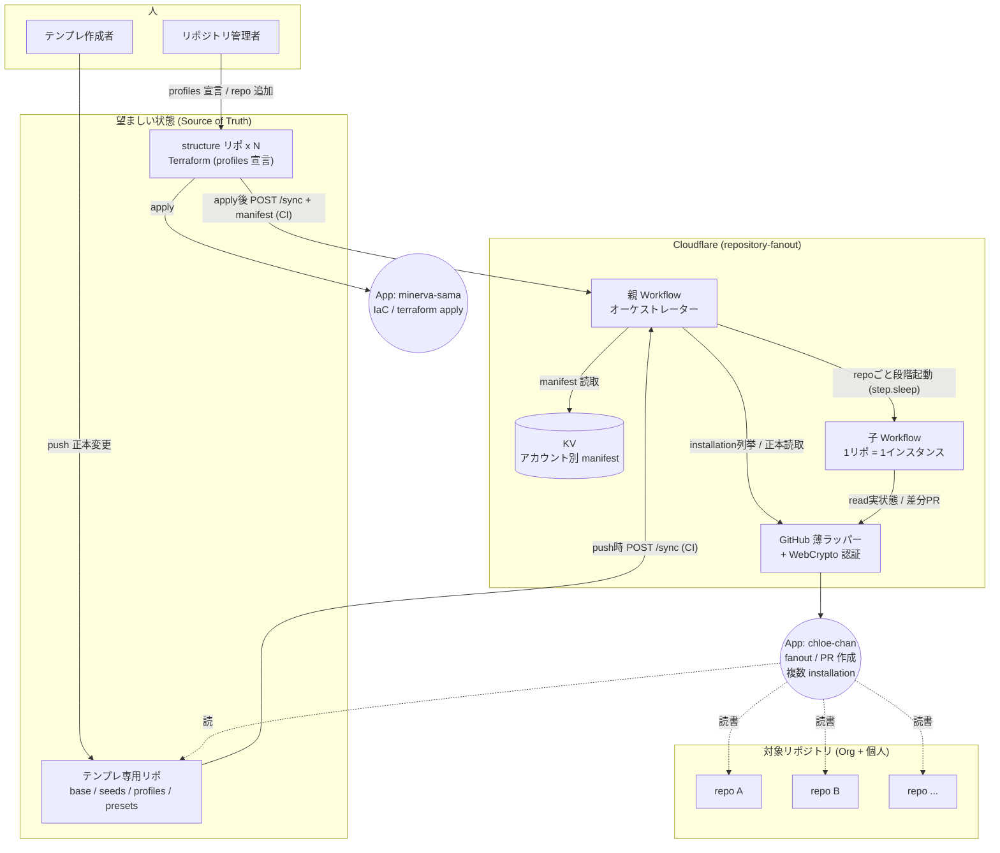
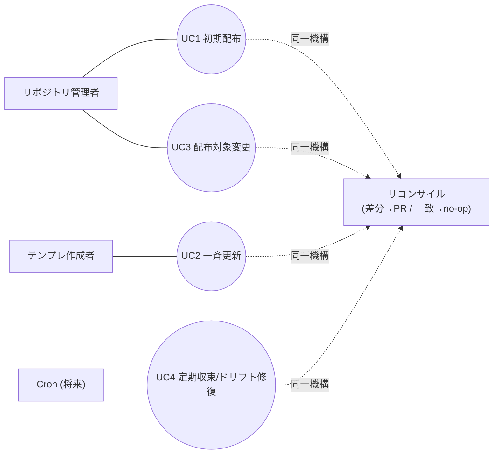
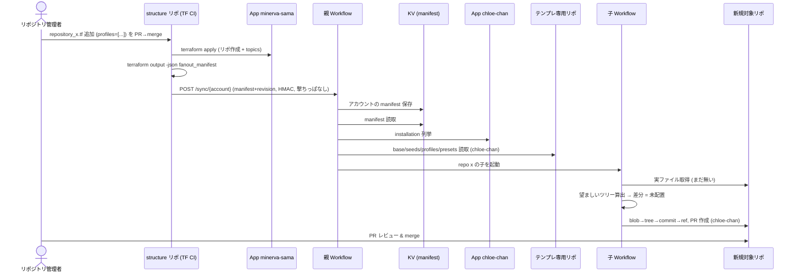
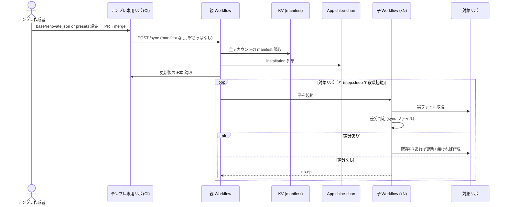
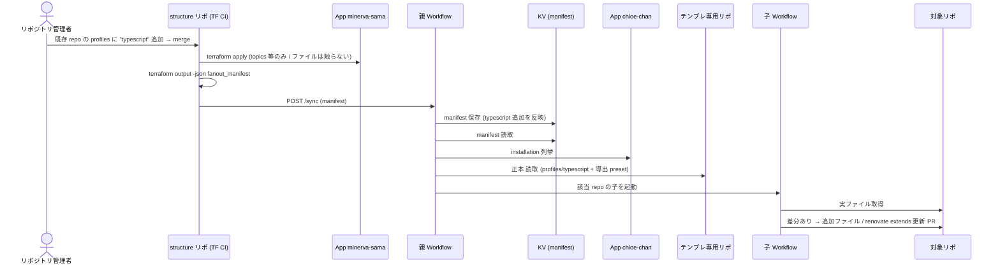
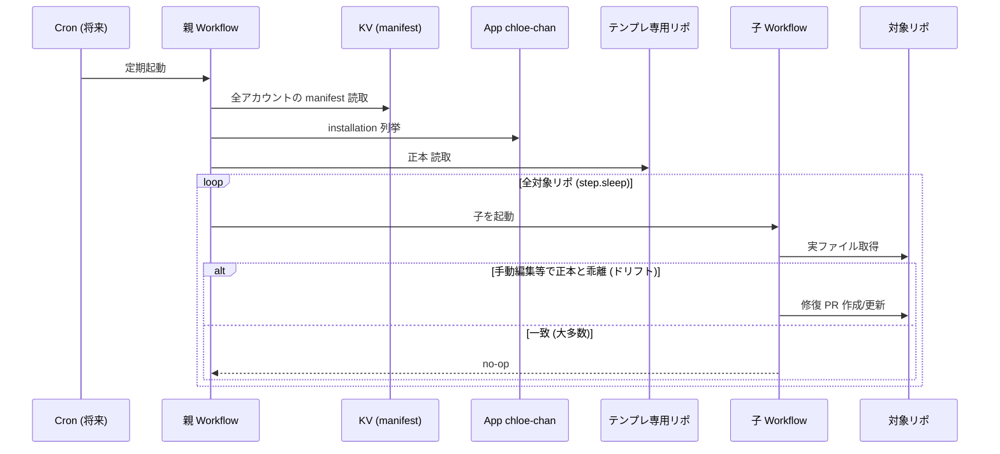

# repository-fanout 設計ドキュメント

> ステータス: 設計確定（ブレスト合意済み）
> 最終更新: 2026-06-26

---

## 1. 目的

共通ファイル（renovate.json、CODEOWNERS、release.yml 等）を、Org（bright-room）と個人（kukv ほか今後2-3人）の複数リポジトリへ**自動配布・自動更新**する仕組みを構築する。

既存の v0（GitHub Actions による初期配布のみ。`organization-structure/.github/` および `kukv/structure/.github/` に重複実装）を置き換え、次を実現する。

1. **初期配布**：新規リポジトリへ必要なファイルを PR で投入する。
2. **更新配布**：正本ファイルが更新されたとき、対象リポへ更新版 PR を出す。
3. **ドリフト修復**：手動編集等で正本と乖離したファイルを PR で元に戻す（※定期実行は将来。§6 参照）。

上記を**単一のリコンサイル経路**で扱う（後述）。

### v0 からの主な変更点

- 初期配布のみ → **更新まで対応**（リコンサイラ化）。
- 除外リスト方式（`exclude-repos.json`）→ **Terraform による明示的な配布宣言（manifest）**。
- GitHub Actions ランナー実行 → **Cloudflare Workflows**（durable execution・レート制限耐性）。
- Org / 個人で重複した仕組み → **単一システムに集約**。
- 「何を配るか」をファイル名で指定 → **リポの素性（言語/フレームワーク）を宣言**し配布物を導出。

---

## 2. アーキテクチャ概要：リコンサイラ（レベル駆動）

本システムの中核思想は **「イベントを捕まえて push する」のではなく「望ましい状態へ収束させる」** こと。

- **望ましい状態（desired state）** = テンプレ専用リポの正本コンテンツ ＋ manifest（どのリポがどの profile か）。
- **実状態（actual state）** = 各対象リポの実ファイル。
- リコンサイラは両者を比較し、**差があれば PR を出す／差がなければ何もしない**。

これにより「新規配布」「更新配布」「ドリフト修復」が**すべて同一コード経路**になり、更新の配布手段を個別に設計する必要がなくなる（正本が変われば次のリコンサイルで収束する）。

### リポジトリ構成（3分離）

| リポ | 役割 |
|---|---|
| **テンプレ専用リポ**（新規・要命名 / 候補: `common-files` 等） | 正本。配布物・renovate preset を保持。**このリポへの push が「更新」の発火点。** |
| **repository-fanout**（本リポ） | Cloudflare Workers / Workflows のリコンサイラ本体。 |
| **structure リポ**（`bright-room/organization-structure`、`kukv/structure` ほか） | Terraform が repo→profiles を宣言。on-merge で manifest を生成し fanout へ `POST /sync`（KV 保存＋reconcile 起動）。 |

---

## 3. データモデル（stack ベース）

「何を配るか」をファイル名で列挙するのではなく、**リポの素性（profile）を宣言**し、配布物はシステムが導出する。

### manifest（Terraform が生成 → fanout の KV に保存。git には置かない）

```json
{
  "account": "bright-room",
  "repositories": {
    "endpoint-gate": {
      "profiles": ["terraform"],
      "vars": { "codeowner": "bright-room/br-maintainers" }
    }
  }
}
```

- `profiles` = 言語/フレームワークを表すフラットなタグ配列（`terraform`, `typescript`, `react` …）。
- `vars` = テンプレ置換用の値（Org/個人差の吸収）。Terraform が注入。
- **保存先は git ではなく fanout の KV**（キー＝アカウント名）。理由は「PR ブランチへ manifest を後追いコミット → CI 二重実行 / 必須チェック未付与で merge ブロック」を避けるため（structure リポは `check-code-style`/`plan`/`validate` を必須チェックにしている）。manifest のレビューは .tf の diff＋plan コメントで代替する。

### テンプレ専用リポ構成

**1 profile = 1 自己完結ディレクトリ**。profile の全貢献（配布ファイル＋renovate 等の合成設定）をそのディレクトリに集約し、中央マップを持たない。具体例は `docs/superpowers/specs/sample/` を参照。

```
common-files/
  base/                       # 全リポに常時適用される暗黙の profile
    profile.json              #   非ファイル貢献の宣言（renovate extends 等）
    files/                    #   常時配布・sync
      renovate.json           #     {"extends": [{{renovate_extends}}]} ← fanout が描画
      .github/CODEOWNERS      #     {{codeowner}} 置換
      .github/release.yml
  seeds/                      # 全リポ共通・常時配布・create-only（初回のみ、以後触らない）
    ...
  profiles/                   # 宣言された profile の時だけ適用・sync
    terraform/
      profile.json            #   { "renovate": ["github>.../presets/terraform"] }
      files/                  #   profile 固有の配布ファイル（あれば）
    springboot/
      profile.json            #   { "renovate": ["group:springBoot"] }（ファイルなし）
    typescript/
      profile.json
      files/.editorconfig
  presets/                    # renovate preset 本体（renovate が extends で取得）
    default.json  terraform.json  typescript.json
```

> **テンプレ専用リポは public 推奨**：各リポの renovate が `extends` で preset を解決するため。private にする場合は Renovate（Mend App / self-hosted）側にそのリポへの read 権限付与が別途必要。
>
> **テンプレ専用リポのガバナンス（必須）**：public かつコンテンツの SoT なので、誤/悪意マージが多数リポへ伝播する。**ブランチ保護・CODEOWNERS・必須レビュー・必須ステータスチェック**を課す（structure リポと同等）。Terraform 管理対象に含めて宣言的に設定する。
>
> **preset 参照のリポ名はレンダラ変数**：`github>bright-room/common-files//presets/...` の `owner/repo` 部分は fanout の設定値（例 `templatesRepo`）として持ち、profile.json には相対参照を書く。テンプレリポ名変更時に1か所で済む（リポ名は §12 で確定）。

**profile.json**：`files/` に静的に置けない「合成が必要な貢献」を宣言する。今は `renovate`（extends エントリ）と `gitignore`（行の配列）。将来 profile ごとの合成が要るツールが増えても **キーを足すだけ**で拡張でき、profile の定義はそのディレクトリ1か所に集約され続ける。**配布ファイルを足すだけなら `files/` に置くだけ（fanout 改修不要）。**

### 配布物の導出ルール（fanout）

対象リポ（宣言 profiles = `P`）に対して：

- **配布ファイル** = `base/files/**` ∪ `seeds/**` ∪ （各 `p ∈ P` の `profiles/p/files/**`）。
  - 同一パスを複数 profile が出したら **衝突＝設定エラー**（1パス=1提供元）。
  - **未知 profile はエラー**：`profiles/<tag>/` が存在しない `p` を宣言したら reconcile せずエラー（Terraform 側のタイポが黙って base のみ配布に劣化するのを防ぐ）。「貢献なし」を許すタグは空ディレクトリ/空 profile.json を明示的に置く。
- **sync / create-only はファイルの置き場所で決まる**（全リポ共通の属性）。
  - `base/files/`・`profiles/<tag>/files/` → **sync**（常時収束）。
  - `seeds/` → **create-only**（対象パスが無い時だけ配置、既存なら一切触らない）。
- **renovate.json の描画**：`base/files/renovate.json` の `{{renovate_extends}}` を、profile.json から集めた extends で置換。
  - `extends = base.profile.json.renovate ++ (各 p の profile.json.renovate を宣言順に連結)`、重複は先勝ちで除去。
  - 例：`["terraform"]` → `[default, terraform]` ／ `["java","springboot"]` → `[default, "group:springBoot"]`（java は renovate 空）／ `["kotlin","ktor"]` → `[default]`。
  - 自前 preset・renovate 組み込み preset（`group:springBoot` 等）・「何も足さない」を同じ仕組みで表現。renovate は extends を上から順にマージし後が前を上書き（共通→言語固有の順）。
- **配布ファイルは static と composed の2種**：
  - **static** … `files/` のファイルをそのままコピー（例 `.github/release.yml`、profile 固有の `.editorconfig`）。
  - **composed** … `base/files/` のプレースホルダ入りテンプレ＋各 profile.json の貢献を fanout が合成（例 `renovate.json`＝`{{renovate_extends}}`、`.gitignore`＝`{{gitignore}}`）。`.gitignore` はネイティブ合成が無いのでこの機構を使う。
  - composed は **型付きレンダラのレジストリ**で扱う：プレースホルダごとに「貢献の型・連結/dedup・シリアライズ（JSON 配列要素 / 改行区切り行 等）・検証」を1エントリとして登録する。新しい composed ファイルの追加は**このレジストリに1エントリ足す**ことで対応（汎用文字列置換で済ませない＝誤レンダリング/インジェクション防止）。現状エントリは `renovate_extends`（JSON 文字列配列）と `gitignore`（改行区切り行）の2つ。
  - 単純な全リポ共通 `.gitignore` でよければ composed にせず `base/files/.gitignore` に実ファイルを置けば static で配れる。
  - **注意**：`.gitignore` 等リポが独自に育てるファイルは、sync だと既存エントリを上書きする PR が出る（破壊ではなく PR 越し）。MVP は「全集中管理」。リポ独自エントリを温存したくなったら **managed ブロック方式**（`# >>> fanout >>>` 〜 `# <<< fanout <<<` だけ更新）へ composed 描画を差し替える（将来）。

### テンプレ変数置換

- **ロジックなしの `{{var}}` 置換のみ**（条件分岐・ループなし）。Workers の CPU 10ms / サイズ 3MB 制約に配慮し、重いテンプレートエンジン依存を入れない。
- プレースホルダを含まないファイルはそのまま通過する。
- `{{renovate_extends}}` のみシステム導出変数（profile.json から合成）、その他（`{{codeowner}}` 等）は manifest の `vars` 由来。

### CODEOWNERS の可変性

- テンプレ `* @{{codeowner}}`。
- `vars.codeowner` を Terraform が注入。**アカウント既定**：Org → `bright-room/br-maintainers`、個人 → そのアカウント名。**repo 単位で上書き可**。
- **opt-out 機構**：base は常時適用だが、`* @{{codeowner}}` 単行で足りない repo（パス別ルール等）のために、manifest で **ファイル単位の opt-out** を宣言できる（例 `"exclude": [".github/CODEOWNERS"]`）。除外されたパスは fanout が触らず、repo が自前管理する。base 全体を放棄する必要はない。

### Terraform 設定例

```hcl
# organization-structure/terraform/repository_endpoint-gate.tf
module "repository_endpoint_gate" {
  source = "./modules/repository"

  name        = "endpoint-gate"
  description = "..."
  topics      = ["..."]

  profiles = ["terraform"]          # ← このリポの素性を宣言

  fanout_vars = {
    codeowner = "bright-room/br-maintainers"   # 未指定ならアカウント既定
  }
}
```

```hcl
# organization-structure/terraform/_fanout_manifest.tf
locals {
  fanout_manifest = {
    account = "bright-room"
    repositories = {
      (module.repository_endpoint_gate.name) = {
        profiles = module.repository_endpoint_gate.profiles
        vars     = module.repository_endpoint_gate.fanout_vars
      }
      # repo を増やすたびここに1行追加（or for_each 化）
    }
  }
}

output "fanout_manifest" { value = local.fanout_manifest }
```

**manifest の生成・保存タイミング**：

- **マージ → on-merge で apply（minerva-sama）成功後**、`terraform output -json fanout_manifest` で manifest を得る。
- on-merge が **fanout の HTTP エンドポイント `POST /sync/{account}` へ manifest を送信**（アカウント別 HMAC＋timestamp で認証、§16-1）。fanout は検証後 **KV にそのアカウントの manifest を保存**し、reconcile を起動（＝manifest 送信と kick が1コール）。
- CI 側に Cloudflare 認証情報は不要（KV 直書きでなく fanout エンドポイント経由）。
- KV には常に各アカウントの最新 manifest があるので、UC2（テンプレ更新で全リポ収束）でも fanout は KV から全アカウント分を読める。

**実装上の注意**：現状は repository ごとに1ファイル（module ブロック）構成のため、manifest 集約にはルートで各 module を明示参照するボイラープレートが要る（または `for_each` 化を検討）。

---

## 4. リコンサイル動作

```
親 Workflow（kick: on-demand。将来 Cron も）
  1. KV から manifest を読む（structure kick なら当該アカウント、テンプレ kick なら全アカウント分）
  2. chloe-chan の App JWT で installation を列挙し、各アカウントのトークンを取得
  3. テンプレ専用リポから base/seeds/profiles/presets を読む（= 望ましい状態の素）
  4. 対象リポごとに子 Workflow を step.sleep を挟みつつ段階的に起動
        ▼
子 Workflow（1リポジトリ = 1インスタンス）
  - 望ましいツリーを算出（base ∪ seeds ∪ 宣言 profiles のファイル、{{var}} 置換）
  - 対象リポの実ファイルを読み、比較
    - sync ファイル：正本と差があれば更新対象
    - create-only ファイル：対象パスが存在しなければ配置対象、存在すれば無視
  - 差分ゼロ → no-op（PR を作らない）
  - 差分あり → **直前に base ブランチの SHA を取得** → blob → tree → commit → **ref を条件付き更新（409 は差分取り直してリトライ）** → PR（PR/ブランチのライフサイクルは §5）
  - 各ステップは冪等・独立リトライ + バックオフ。429/403/ref 競合(409) を吸収（リトライ規約・並行制御は §16）
```

- **配布対象リポの母集合 = 全アカウントの manifest の `repositories` キー**（GitHub のリポ全列挙はしない）。
- **installation 突き合わせの失敗はアカウント単位の hard failure**：KV にあるアカウントに chloe-chan の installation が無い／対象リポが installation のアクセス範囲外なら、黙ってスキップせず失敗として記録・表面化する（§16 可観測性）。`/sync` 受信時にも installation 非カバーのアカウントは 4xx で拒否。
- **KV manifest は使用前に検証**：(a) installation のアクセス範囲（アカウント・リポ）と突き合わせ、(b) 許可アカウントのアローリストに含まれること、(c) スキーマ妥当性、(d) 後述の世代メタdata。いずれか外れたら reconcile しない（KV 汚染の影響を限定。§16 セキュリティ）。
- **状態は KV の manifest のみ**：望ましい状態のうち「配布物の中身」はテンプレ専用リポ（git）から都度取得、「どのリポに配るか（manifest）」は KV から取得。実状態は対象リポから都度取得。ロジック自体はステートレス（KV はターゲティング情報の置き場）。installation トークンキャッシュにも KV を流用可。
- レート制限耐性は Workflows のステップ単位チェックポイント + 自動リトライ + `step.sleep` で確保（待機中は CPU 時間・課金なし）。具体的な並行数バジェット・`Retry-After` 尊重は §16。

---

## 5. PR の振る舞い

- 1リポジトリ = 1 PR（そのリポの全配布物をまとめる）。固定ブランチ名（例: `chore/distribute-common-files`）。
- ラベル：既存の `Kind: Dependencies` を流用するか専用ラベルを新設する（**要決定**。実装時に確定）。

### ブランチ / PR ライフサイクル（冪等性）

固定ブランチ＋PR の状態を毎回判定して分岐する：

| 状態 | 望ましいツリーに差分あり | 差分なし |
|---|---|---|
| **オープン PR あり** | 既存ブランチを更新（force ではなく ref 条件付き更新） | 何もしない（no-op） |
| **PR が closed（未マージ）** | 既存ブランチを更新し PR を再オープン（不可なら新規作成） | 何もしない |
| **PR が merged・ブランチ残存** | ブランチを default 最新から作り直して新規 PR | ブランチを削除（残骸掃除） |
| **ブランチのみ存在・PR なし** | ブランチを更新して PR 作成 | ブランチを default 最新へ更新 or 削除 |
| **何も無い** | ブランチ作成 → PR 作成 | 何もしない |

- ブランチ作成/更新は常に **default ブランチの最新 SHA を base** にし、ref 更新は条件付き（409 は取り直し）。
- 「PR が closed＝人が拒否した」可能性に配慮し、**短期間の連続再オープンは避ける**（再オープン抑制のクールダウンは §16 の運用方針で扱う）。

### 削除 / 孤児ファイル（MVP スコープ外・意図的）

- 宣言されたパスの**追加・更新のみ**を行い、**削除はしない**（これは意図的なランタイム挙動）。
- profile/リポが manifest から外れても、過去に配ったファイルは**残置**される（掃除しない）。将来 cleanup モードを別途追加。

---

## 6. トリガー

- **MVP：on-demand kick のみ**（何かを起点に動けばよい）。エンドポイント仕様・認証は §16 にまとめる。
  - **structure リポの on-merge**：apply 後に manifest を生成し `POST /sync/{account}`（body = 当該アカウントの manifest＋世代メタ）。fanout は検証・KV 更新して reconcile 起動。
  - **テンプレ専用リポへの push**：`POST /sync`（manifest なし）。fanout は KV の全アカウント manifest で reconcile 起動。
  - 手動起動も可。
- **kick は撃ちっぱなし（fire-and-forget）**：CI は受理応答（200/202）を受けたら即終了。配布は Cloudflare Workflows 側で非同期継続（CI を待たせない）。ただし **CI 側は POST をバックオフ付きでリトライし、未受理なら workflow を fail させる**（唯一のトリガーを取りこぼさないため）。
- **manifest 世代管理**：POST body に **ソースのコミット SHA / 単調増加リビジョン**を含める。fanout は KV の現行より古いリビジョンを **拒否（compare-and-set）**。空 manifest も拒否（§4 検証）。
- **MVP の許容 staleness と手動リプレイ**：Cron が無いため、CI 失敗・取りこぼし・手動ドリフトは次の kick まで未修復になりうる。これを許容範囲とし、**手動で `/sync` を再実行する runbook** を用意する（§16）。Cron による定期収束（UC4）は安定後に追加。
- **GitHub webhook / Webhook Worker / 署名検証 / 10秒応答制約は不要**（IaC・CI 駆動で代替）。

---

## 7. 認証・マルチアカウント

GitHub App の役割を2つに分離する。

| App | 役割 |
|---|---|
| **minerva-sama** | IaC 担当：structure リポの `terraform apply`（リポ作成・topics・ruleset 等） |
| **chloe-chan** | fanout 担当：テンプレ専用リポの読取、対象リポへの **PR 作成**（blob→tree→commit→ref→PR）。※manifest は KV 由来で GitHub からは読まない |

- **単一 App（chloe-chan）を Org + 各個人アカウントにインストール**する。
- リコンサイラは chloe-chan の秘密鍵で JWT（RS256, WebCrypto）を署名 → `GET /app/installations` で installation を列挙 → installation 単位のトークンを取得して当該アカウントのリポを収束させる。
- 新ユーザー追加は「App をそのアカウントに入れる」＋「そのアカウントの structure リポ on-merge から `POST /sync` する」だけ（fanout 側の設定変更は不要）。
- App 秘密鍵・kick 認証シークレットは Worker Secrets（`wrangler secret`）で管理。
- **chloe-chan の最小権限**（必要十分のみ付与）：
  - Repository: **Metadata: read**, **Contents: read/write**（blob/tree/commit/ref）, **Pull requests: read/write**。
  - ラベル付与に Issues API を使うなら **Issues: read/write** を追加（PR ラベルは Issues スコープ）。それ以外（Administration / Checks 等）は付与しない。
- **private リポでも問題なし**：structure リポ・対象リポが private でも、chloe-chan がそのアカウント／リポにインストールされ上記権限があれば installation token で読み書きできる（公開 API・検索には依存しない）。ただし renovate preset を置くテンプレ専用リポは public 推奨（§3 参照）。

### アカウントの突き合わせ

- manifest は KV にアカウント名キーで保存される。installation 列挙で得たアカウント login と KV のキーを突き合わせてトークンと manifest を対応付ける。**静的なアカウント→リポのマッピングは不要**。

---

## 8. 技術スタック

- **言語/ランタイム**：TypeScript + Cloudflare Workers / Workflows。
- **GitHub クライアント**：生 `fetch` + 自作の薄ラッパー（Git Data API: blob → tree → commit → ref → PR）。依存ゼロでバンドル軽量・CPU 軽量に保ち、Workers 制約に最適化。
- **認証**：WebCrypto で JWT 署名 → installation token 取得（自作）。
- **バージョン固定**：Workflows は変化が速いため、Wrangler / 互換日付を固定し、定期的に最新仕様を確認する前提で進める。

### プロジェクト構成（pnpm モノレポ：core / worker 分離）

```
repository-fanout/
  pnpm-workspace.yaml
  packages/
    core/         # @repository-fanout/core : runtime非依存・純TS
      github/     #   Git Data API クライアント (fetch)
      auth/       #   JWT署名(WebCrypto) → installation token
      manifest/   #   manifest パース/型
      templates/  #   正本ロード・{{var}}置換・renovate extends 合成
      reconcile/  #   望ましいツリー算出・差分判定（純関数）
  apps/
    worker/       # Cloudflare Workers/Workflows エントリ
      workflows/  #   親/子 Workflow (WorkflowEntrypoint, step.do/sleep)
      http/       #   /sync エンドポイント（HMAC 認証・検証）
      wrangler.toml
    cli/          # 手動リコンサイル / dry-run（core 利用・Node 実行。§16-5 フォールバック）
  docs/
```

- **core は Cloudflare 依存ゼロ**。`fetch` / `crypto.subtle` は Workers・Node 20+ 両方でグローバルなので runtime 非依存に保てる。
- `WorkflowEntrypoint` / `step` 等の Cloudflare 依存は **worker 側のみ**。core は純関数/クラスを提供し、worker が step で束ねる。
- **テスト**：core は Node + vitest で TDD（Workers ランタイム不要）、worker は miniflare / workers vitest pool。
- **KV binding** は worker 側（wrangler.toml）。core は KV を直接触らず、manifest の入出力はインターフェース越しに受け取る（runtime 非依存を維持）。

---

## 9. 配布物（MVP）

v0 で既に配布実績のある以下を `base/files/` に置く（全リポ共通・sync）。

| ファイル | 種別 | 内容 | MVP |
|---|---|---|---|
| `renovate.json` | composed | `{"extends": [{{renovate_extends}}]}` | ✅ |
| `.github/CODEOWNERS` | static(置換) | `* @{{codeowner}}` | ✅ |
| `.github/release.yml` | static | リリースノート分類 | ✅ |
| `.gitignore` | composed | `{{gitignore}}`（base＋profile 行を合成） | ✅ **MVP に含める**（composed レジストリの2例目。sample 実装済み） |

`presets/default.json` に現行 renovate.json の共通設定を集約し、言語固有分は `presets/<lang>.json` に分割（各 profile の profile.json が extends で参照）。`profiles/<tag>/files/`・`seeds/` は当面空でよく、必要が出た時点で追加する。

---

## 10. 実装フェーズ（案）

1. **テンプレ専用リポ作成**：`base/`・`presets/` レイアウトに v0 テンプレ＋renovate preset を移植。Terraform 管理対象に追加。
2. **Terraform 拡張**：repository モジュールに `profiles` / `fanout_vars` を追加、`fanout_manifest` output を生成（org + 個人 structure リポ）。on-merge で `terraform output` → fanout へ `POST /sync`。
3. **fanout リコンサイラ**：`POST /sync/{account}` エンドポイント（HMAC＋timestamp 認証・manifest 検証・CAS）＋ KV 保存 → GitHub 薄ラッパー + 認証 → 子 Workflow（1リポ収束・冪等リトライ）→ 親 Workflow（KV manifest 検証 / installation 列挙・並行制御つき段階起動）。run 結果記録（§16-4）。
4. **トリガー配線**：on-demand kick（テンプレリポ push / structure リポ on-merge から `POST /sync`、CI リトライ付き）。
5. **手動リコンサイル / dry-run CLI**（core 利用、§16-5）。
6. **v0 撤去**：両 structure リポの旧 `distribute-initial-files` 系を削除。
7. **（将来）Cron による定期収束を追加。**

---

## 11. 確定した既定判断

1. データモデルは **stack ベース**（`profiles` 宣言）。配布物・renovate preset は規約で導出。
2. manifest は **git に置かず KV に保存**（on-merge が apply 後に fanout `POST /sync` へ送信、fanout が KV 保存＋reconcile）。PR ブランチへの後追いコミットを避け、CI 二重実行・必須チェック未付与による merge ブロックを回避する。
3. テンプレ置換は **`{{var}}` のみ**（条件分岐・ループなし）。
4. sync / create-only は **ファイルの置き場所で決まる**（`base`/`profiles`=sync、`seeds`=create-only。全リポ共通の属性。mode フィールドなし）。
5. ロジックはステートレス。**状態ストアは KV のみ**（用途＝アカウント別 manifest のターゲティング情報、必要なら installation トークンキャッシュ）。D1 は使わない。
6. **削除 / 孤児ファイル掃除はスコープ外**（将来）。
7. トリガーは **MVP は on-demand kick のみ**、Cron は将来。
8. App 役割分離：**minerva-sama=IaC、chloe-chan=fanout**。
9. profile は **自己完結ディレクトリ**（`profile.json` で非ファイル貢献を宣言＋`files/` で配布ファイル）。中央マップは持たない。renovate の extends は各 profile.json の `renovate` を合成。
10. manifest は **on-merge が apply 後に生成し fanout `POST /sync/{account}` で送信→検証→KV 保存→reconcile**。世代メタ（commit SHA / revision）で CAS、空 manifest 拒否。kick は撃ちっぱなしだが CI 側はリトライ。
11. テンプレ専用リポは **public**＋**ブランチ保護・必須レビュー必須**（renovate preset 解決＋伝播リスク対策）。
12. 実装は **pnpm モノレポ**で **core（runtime非依存）/ worker（Cloudflare）を分離**。
13. `/sync` 認証は **アカウント別シークレットの HMAC＋timestamp**（アカウント紐づけ・リプレイ窓）。共有単一シークレットは採らない（§16-1）。
14. PR は **固定ブランチのライフサイクル**で冪等化（open/closed/merged/競合を分岐。§5）。write ステップは冪等＋`Retry-After` 尊重リトライ（§16-2）。
15. **未知 profile はエラー**、CODEOWNERS 等は manifest の **ファイル単位 opt-out** 可（§3）。
16. composed は **型付きレンダラレジストリ**で扱う（§3）。`.gitignore` も MVP 対象。
17. **可観測性**：run/アカウント/リポ単位の状態を記録し、失敗をアラート・部分再試行可能（§16-4）。

## 12. 実装時に確定する未決事項

- テンプレ専用リポの名称（preset 参照はレンダラ変数化済みなので後変更も1か所、§3）。
- PR ラベル（既存流用 or 新設）。
- 並行数バジェット・バックオフ上限・timestamp 許容窓の具体値（§16 の枠組みは確定、数値は実装時にチューニング）。

---

## 13. システム関連図



---

## 14. ユースケース

| # | ユースケース | アクター | トリガー | 配布の意味 |
|---|---|---|---|---|
| UC1 | 新規リポへの初期配布 | リポジトリ管理者 | structure リポへ repo 追加 → apply → kick | 未配置ファイルを投入 |
| UC2 | 正本更新の一斉配布 | テンプレ作成者 | テンプレ専用リポへ push → kick | 既存ファイルを更新 |
| UC3 | 配布対象変更 | リポジトリ管理者 | 既存リポの `profiles` 宣言を変更 → kick | 追加 profile を配布 |
| UC4 | 定期収束・ドリフト修復（**将来**） | Cron（システム） | スケジュール | 乖離を検出して修復 / 大多数は no-op |



> ユースケースはトリガーと意図が違うだけで、機構は同一のリコンサイルに収束する（本設計の肝）。UC4 は MVP では見送り。

---

## 15. シーケンス図

### UC1: 新規リポへの初期配布



### UC2: 正本更新の一斉配布



### UC3: 配布対象変更（profiles 宣言の追加）



### UC4: 定期収束・ドリフト修復（Cron / 将来）



---

## 16. 信頼性・セキュリティ・運用（レビュー反映）

Codex レビュー（`2026-06-26-repository-fanout-codex-review.md`）の HIGH/MEDIUM を反映した横断的事項。

### 16-1. `/sync` エンドポイントと認証

- パス：`POST /sync/{account}`（structure kick・manifest 付き）／`POST /sync`（テンプレ kick・manifest なし＝全アカウント reconcile）。
- 認証：**アカウント別シークレットによる HMAC 署名**。リクエストヘッダに `X-Fanout-Timestamp` と、`HMAC(secret_account, timestamp + "." + rawBody)` を載せる。
  - **アカウント紐づけ**：`{account}` のシークレットで検証＝1アカウントのシークレット漏洩が他アカウントに波及しない（共有シークレット単一の poison を防ぐ）。
  - **リプレイ防御**：timestamp の許容ズレ窓（例 ±5 分）を超えたら拒否。可能なら nonce/直近リビジョンで再利用検出。
- ボディ検証：スキーマ＋世代メタ（`sourceCommit` / 単調 `revision`）。KV の現行より古い revision は **CAS で拒否**、空 manifest は拒否。
- KV キー設計：`manifest:{account}`（値＝検証済み manifest＋revision）。認証・キー規則は実装詳細でなく設計制約として固定（§12 から昇格）。

### 16-2. リトライ規約（冪等性）

- **すべての write ステップを冪等に**：blob/tree は内容ハッシュで再利用、ref 更新は base SHA 条件付き、PR は固定ブランチで「無ければ作成・あれば更新」。
- リトライ対象：`429` / `403`（セカンダリ）/ `5xx` / ref 競合 `409`。**`Retry-After` を尊重**した指数バックオフ、最大試行回数と上限待機を設定。
- 非リトライ：`401/404/422`（権限・不存在・検証エラー）は即 fail として記録（無駄な再試行をしない）。
- poison（恒久失敗）はそのリポを fail マークして次へ進み、run 全体は止めない。

### 16-3. 並行制御（GitHub レート制限）

- **installation 単位の並行数バジェット**で子 Workflow の同時実行を制限（セカンダリ制限のバースト増幅を防ぐ）。`step.sleep` で投入間隔を空ける。
- 1次レート（~5,000 req/h/installation）と1リポ ~8 コールから、現実的な投入ペースを設定（目安 §6/§7）。

### 16-4. 可観測性・部分失敗のリカバリ

- **run 結果を KV（または D1）に記録**：run 単位＋アカウント単位＋リポ単位の状態（success / no-op / failed＋理由）。
- 失敗時アラート（ログ/通知）。HTTP 202 後の失敗が見えなくならないようにする。
- **部分 fan-out 再試行**：run 結果を見て「失敗したリポだけ」を再 kick できる（全件やり直し不要）。
- installation 突き合わせ失敗（§4）も run 結果に failed として残す。

### 16-5. 運用 runbook（MVP）

- **手動リプレイ**：CI POST 失敗・取りこぼし・手動ドリフト時に、対象アカウント/全体の `/sync` を手動再実行する手順を用意。
- **許容 staleness**：Cron 不在のため最大 staleness は「次の kick まで」。これを許容とし、必要なら手動リプレイで縮める。
- **Workflows 障害時フォールバック**：core パッケージを使う **dry-run / 手動リコンサイル CLI**（Node 実行）を用意し、Cloudflare 側が不調でも最低限の収束・調査ができるようにする（§8 の core 非依存設計を活用）。

### 16-6. 意図的に MVP スコープ外（明記）

- 孤児ファイル掃除（削除）→ 将来 cleanup モード。
- Cron 定期収束（UC4）→ 安定後。
- nonce による厳密なリプレイ完全排除 → timestamp 窓で当面代替。
