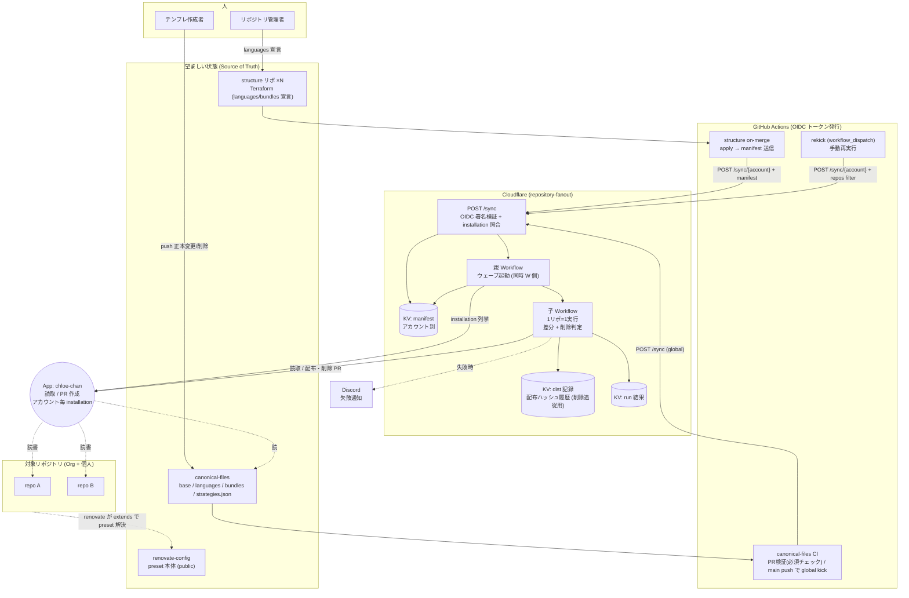
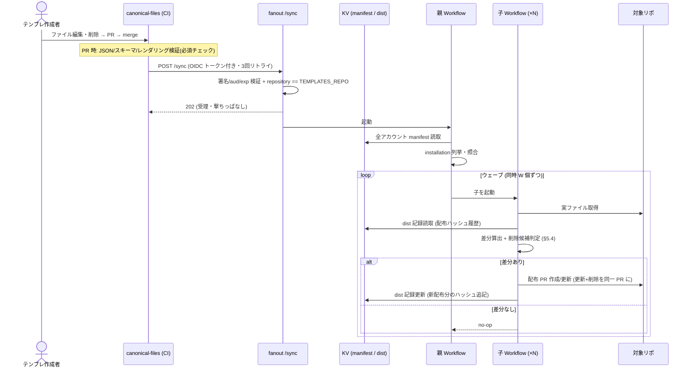
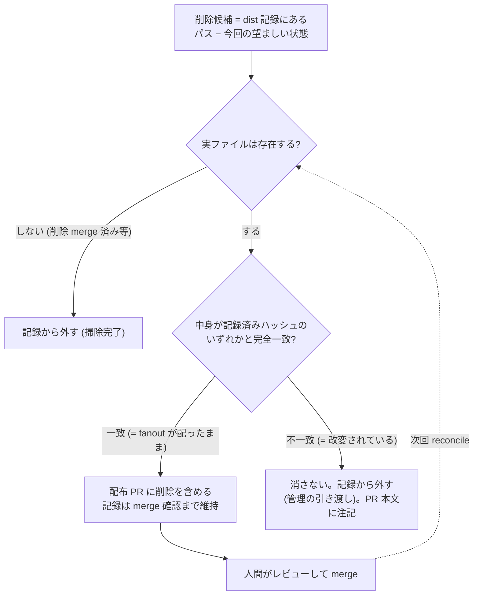

# repository-fanout v2 設計ドキュメント

> ステータス: ドラフト(ユーザーレビュー待ち)
> 作成: 2026-07-04 / 改訂: 2026-07-04(認証を GitHub OIDC 化=シークレット全廃・システム関連図/ユースケース/シーケンス図を追加)
> 前版: `2026-06-26-repository-fanout-design.md`(以下「v1設計書」)。本書は v1 を置き換える。
> 経緯: 前セッションの失敗記録(`SESSION_POSTMORTEM.md`)を受け、要求と設計をゼロベースで見直した。
> 本書の全決定には根拠を付す。根拠の出典は「v1設計書 §n」「ポストモーテム項目」「調査(ファイル:行)」「本セッションのユーザー決定」のいずれか。

---

## 1. 目的

共通ファイル(renovate.json、CODEOWNERS、release.yml、.gitignore 等)を、Org(bright-room)と個人(kukv ほか)の複数リポジトリへ**自動配布・自動更新・自動削除**する。

v1 との最大の違いは **削除追従(retraction)を第一級の要件とする**こと。宣言的配布とは「正本が正であり、配布先は正本に収束する」ことであり、追加・更新だけで削除が無いシステムは宣言的ではない(根拠: ポストモーテム「YAGNI/MVP を思考停止の逃げに使った」・.editorconfig 事件 = 正本から消したファイルを配布先から消せず、配布 PR#17 に不要ファイルが残置)。

## 2. 完了条件(Definition of Done)

以下が全て実際に動作し、**証拠(PR URL 等)を記録**して初めて完了と呼ぶ(根拠: ユーザー決定 2026-07-04。前回は「動いた気がするが経路が半分未配線」で終わった反省から):

1. **UC2 経路**: canonical-files を更新すると自動で全対象リポへ配布される(現状は送信側が存在しない。調査: canonical-files に `.github/workflows/` ディレクトリ自体が無い)
2. **kukv アカウントの組み込み**: kukv/structure からの宣言→配布が動く(現状着手ゼロ。調査: kukv/structure に fanout 関連コミット 0 件)
3. **v0 の完全撤去**: 両 structure リポの distribute-initial-files 一式を削除(現状もマージのたびに稼働中。調査: organization-structure on-merge.yml:48-52 / kukv structure on-merge.yml:50-54)
4. **全リポへの実配布展開**: org 13 リポ + kukv 15 リポに languages 宣言を入れ配布(段階展開。現状は repository-fanout 1 リポのみ。調査: _fanout_manifest.tf:5-7)
5. **削除追従の実証**: 正本からファイルを消す→配布先に削除 PR が出る、を実リポで確認

**スコープ外(意図的)**: Cron 定期収束(ユーザー決定: 従来通り将来へ)/ リポが manifest から外れた際の掃除(§5.6)/ python の renovate preset 整備(canonical-files 側の既知 TODO)。

## 3. 決定事項一覧(根拠付きサマリ)

| # | 決定 | 根拠 |
|---|---|---|
| D1 | 設計はゼロベース、コードは新設計と一致する部分のみ選別再利用 | ユーザー決定。既存 core は 117 テスト全パスで健全(調査)、失敗の本質は設計とプロセス(ポストモーテム) |
| D2 | 実行基盤は Cloudflare Workers/Workflows + KV を維持(v1 の案を完成させる) | ユーザー決定。デプロイ済み資産の活用・将来の規模拡大への備え |
| D3 | 削除追従を実装する。対象=①正本からのファイル削除 ②宣言変更に伴う削除 ③exclude 追加時の寄与取り消し | ユーザー決定。宣言的配布の根幹(ポストモーテム申し送り) |
| D4 | リポが manifest から外れた場合は残置(掃除しない)を仕様として明記 | ユーザー決定。renovate.json 等を消すとリポが壊れるため削除が正解とは限らない |
| D5 | 配布記録は KV に保存(配布先リポにロックファイルは置かない)。削除はハッシュ照合ガード付き | ユーザー決定(配布先リポを汚さない)。ズレ対策は §5.3 |
| D6 | 世代番号が「同じ」再送は再実行要求として受理し、必ず reconcile を起動する | 起動失敗で永久停止する穴の除去(ポストモーテム A-2。構造成立をコードで確認: apps/worker/src/index.ts:67-70) |
| D7 | 認証・認可を **GitHub OIDC + App インストール照合**に全面変更。HMAC・アカウント別シークレット・アローリストは廃止(完全ゼロコンフィグ) | ユーザー決定 2026-07-04。v1 の自己矛盾(§7「新ユーザー追加に fanout 側の設定変更は不要」vs §16-1 のアカウント別シークレット)を §7 側の思想で解消。アカウント追加時の fanout 側作業をゼロにする |
| D8 | 並行制御はウェーブ方式(同時最大 W 個ずつ起動)。具体値は実装時調整 | v1 §16-3 の「並行数バジェット」が未実装だった(調査: 2 秒間隔の起動間引きのみ) |
| D9 | 部分再試行: `/sync/{account}` に repos フィルタを追加 | v1 §16-4 の「失敗リポだけ再 kick」が未実装だった(調査: getRun 呼び出し元 0 件) |
| D10 | CLI に apply(書き込み)モードを追加 | v1 §16-5 の障害時フォールバックが dry-run のみで片肺だった(調査: P5 プランで任意扱いのまま未実装) |
| D11 | canonical-files に CI を新設(PR 検証=必須チェック化+main push で全体配布 kick) | 正本に CI ゼロ(調査)。壊れた JSON が全リポへ伝播しうる。v1 §3 のガバナンス要件の実現 |
| D12 | URL は workers.dev で恒久化。独自ドメインは復活させない | Bot Fight Mode が CI を遮断(ポストモーテム D-11)。独自ドメイン TF は PR#34 でリバート済み(GitHub API で確認) |
| D13 | Workflow 配線テストを必須化 | 親/子 Workflow 本体にテストが無いままだった(調査: apps/worker/test に workflows/ が不存在) |
| D14 | renovate.json の整形差異(extends 変更時の再シリアライズ)は無害として許容を明文化 | ポストモーテム C-8。黙って先送りにしない |

## 4. アーキテクチャ全体像

### v1 から維持するもの(実績と調査で健全と確認済み)

- **3 リポ分離**: canonical-files(配布物の正本)/ renovate-config(preset の正本・public)/ repository-fanout(エンジン)
- **宣言 2 軸**: Terraform で repo → languages + bundles を宣言し、配布物を導出。manifest は on-merge で `POST /sync/{account}` 送信→KV 保存
- **リコンサイラ方式**: 望ましい状態と実状態を比較し、差分があれば PR・無ければ no-op。新規配布/更新/削除が同一経路
- **4 つの sync 戦略**: replace / create-only / managed-block / extends-field(strategies.json 駆動、不在は fail fast)
- **PR の振る舞い**: 1 リポ = 1 PR、固定ブランチ、PR 状態別のライフサイクル分岐(v1 §5 の表。実装・テスト済みを調査で確認)
- **App 役割分離**: minerva-sama=IaC / chloe-chan=配布(※ /sync の HMAC 認証は v2 で廃止し OIDC へ。§6.2)
- **リトライ規約**: 429/403/5xx/409 リトライ・401/404/422 即 fail・Retry-After 尊重(実装済みを調査で確認)

### v2 で変わるもの

1. 削除追従(§5)
2. トリガー信頼性の修正と未実装項目の完成(§6)
3. UC2 送信側・kukv 配線・v0 撤去(§7・§8)
4. テスト戦略の強化(§9)

## 5. 削除追従の設計

### 5.1 原則

- **fanout は「自分が配ったと証明できるもの」しか消さない。** 全ての故障モードは「消しすぎ」ではなく「残しすぎ」に倒す(不変条件)。
- 削除は必ず配布 PR に含め、人間がレビューする。force 削除はしない(ポストモーテム申し送り)。

### 5.2 戦略別の削除メカニズム

managed-block / extends-field は「fanout の持ち分」がマーカー・管理エントリ集合(universe)から自明なので、**記録なしで宣言の再計算だけで増減が反映される**(現行実装のまま成立)。記録が必要なのはファイル丸ごとを配る replace / create-only のみ。

| 戦略 | 削除候補になった時の挙動 |
|---|---|
| replace | KV 記録+ハッシュ照合の上、削除を PR に含める |
| create-only | ハッシュ一致(=配布時のまま)なら削除。書き換えられていたら残して記録から外す(PR 本文に注記) |
| managed-block | ブロック部分だけ除去(ファイルは残す)。ブロックの中身が空になる場合はマーカーごと除去 |
| extends-field | 管理エントリ(universe 由来)だけ除去。リポ独自エントリ・他キーは不可侵 |

### 5.3 KV 配布記録(replace / create-only 用)

- KV キー: `dist:{account}:{repo}`。**TTL なし(無期限)**。削除は何年後に来るか分からないため。
- 値:

```json
{
  "version": 1,
  "files": {
    ".github/release.yml": {
      "strategy": "replace",
      "hashes": ["sha256:<v1描画結果>", "sha256:<v2描画結果>"]
    }
  }
}
```

- `hashes` は**その repo 向けに fanout が描画・配布した内容のハッシュ履歴**(配列)。理由: 正本が v1→v2 と進んだがリポは v1 しか merge していない時間差があっても、「過去に配ったどれかと一致」すれば安全に削除できる。
- 記録タイミングは **PR ブランチを書いた時点**(merge を待たない)。ハッシュガードがあるため提案時記録でも事故は起きない。

### 5.4 削除の判定フロー(毎回のリコンサイル)

1. 削除候補 = KV 記録にあるパス − 今回の望ましい状態のパス
2. 各候補につきリポの実ファイル(default ブランチ)を読み:
   - **既に不存在**(削除 PR が merge 済み等)→ 記録からパスを外す(掃除完了)
   - 記録済みハッシュの**いずれかと完全一致** → 配布 PR に削除を含める。**記録は維持する**(merge されるまで毎回同じ削除が提案され続ける=冪等。提案時に記録を外すと、PR ブランチは毎回 default から再構築されるため次回リコンサイルで削除が PR から黙って消える)
   - 不一致(改変済み)→ 消さない。記録から外す(管理の引き渡し)。PR 本文に「候補だったが改変されていたため残置」と注記
3. 削除を受け入れたくない場合のリポ側の手段: ファイルを改変する(ハッシュ不一致で引き渡しになる)か、exclude に入れる。PR を close しただけでは差分が残る限り再提案されうる(v1 §5 の「closed+差分あり=再オープン」と同じ扱い。連続再オープンの抑制は v1 §16 の運用方針を踏襲)

### 5.5 exclude(オプトアウト)の意味論

**exclude = 「そのパスへの fanout の寄与ゼロが望ましい状態」**と再定義する(継続的に収束させる。1 回きりの処理ではない):

- managed-block: 望ましい状態=ブロックが無いファイル。ブロックが残っていれば除去 PR、無ければ no-op
- extends-field: 望ましい状態=universe 由来エントリが無い extends。残っていれば除去、無ければ no-op
- replace / create-only: ファイルには触らず(消さない)、KV 記録からパスを外す(=管理の引き渡し)。オプトアウトは「自分で管理したい」の意思表示のため

### 5.6 意図的な残置(スコープ外)

- **リポが manifest から外れた場合**: 配布済みファイルは掃除しない(D4)。renovate.json 等はリポの動作に必要であり、削除が正解とは限らない。必要なら手動で消す。
- **正本から language/bundle ディレクトリ自体を消す場合の運用順序**: 先に全リポの宣言から外す(宣言が残っていれば「未知 language」エラーで気づける)→ その後にディレクトリを消す。逆順で行うと、universe から消えたエントリが「リポ独自」と誤認され extends に残置される(既知の制限として明記)。

### 5.7 フェイルセーフ検証

| 故障 | 結果 | 方向 |
|---|---|---|
| KV 記録の消失 | 記録なし=リポ独自扱い→削除されない。replace は次回配布で記録再開 | 残しすぎ ✅ |
| 配布 PR 拒否後、同パスにリポ独自ファイル作成 | ハッシュ不一致→削除されない | 事故防止 ✅ |
| 並行リコンサイルの記録書き込み競合(last-write-wins) | ハッシュが欠けた版は削除対象外になるだけ | 残しすぎ ✅ |
| v0 が配った古いファイル(記録なし) | replace 対象なら次回配布で収束+記録開始。以後削除追従が効く | 自然回収 ✅ |

残骸(残しすぎ)は PR 本文注記と Discord 通知で人間に可視化する。

### 5.8 実装上の注意

- コミット層(repoIO の commitChanges)は現状**追加・更新のみ対応**(調査: 削除系は deleteBranch のみ)。Git Data API の tree 構築で `sha: null` を指定するファイル削除対応を追加する。
- 削除判定ロジック(候補算出・ハッシュ照合・戦略別挙動)は**全て core の純関数**として実装し、KV 入出力はインターフェース越し(runtime 非依存の原則を維持。v1 §8)。

## 6. トリガーと信頼性

### 6.1 世代管理の修正(永久停止穴の除去)

現状: manifest 保存成功+Workflow 起動失敗→CI リトライは同一 revision→「stale」判定で起動スキップ→以後永久に reconcile されない(ポストモーテム A-2。apps/worker/src/index.ts:67-70 で構造確認済み)。

新ルール:
- 拒否するのは**厳密に古い** revision のみ(4xx 応答)
- **同じ** revision の再送は再実行要求として受理し、manifest 保存結果に関わらず**必ず親 Workflow を起動**する(リコンサイルは冪等なので二重実行は無害。E2E で冪等性は実証済み: 複数回 kick でも配布 PR は 1 つ)
- 起動失敗時は 5xx を返し、CI 側リトライ(kick ワークフローのバックオフ付き 3 回リトライ)に再送させる
- 空 manifest の拒否は維持(誤設定 CI による全消し防止。v1 §6)

### 6.2 認証・認可: GitHub OIDC + App インストール照合(D7)

**廃止するもの**: `SYNC_HMAC_SECRET__<account>` / `SYNC_HMAC_SECRET___global`(worker シークレット)、`FANOUT_HMAC_SECRET`(structure 側シークレット)、timestamp ヘッダと ±300 秒窓、アローリスト(導入せず)。

**認証(誰が送ったか)**: 送信側ワークフローは `permissions: id-token: write` で GitHub から OIDC トークン(GitHub 本体が署名した「どのリポの・どの ref のワークフローか」の身分証明。audience は fanout の URL を指定)を取得し、`Authorization: Bearer` で送る。worker は GitHub の公開鍵(`https://token.actions.githubusercontent.com` の JWKS。キャッシュ可)で署名を検証し、`iss` / `aud`(fanout の URL 固定)/ `exp` を確認する。事前のシークレット共有は一切ない。

**認可(誰に許すか)**:
- `POST /sync/{account}`: トークンの `repository_owner` == `{account}`、かつ **chloe-chan がそのアカウントにインストールされていること**(installation 列挙は実装済みの機構を流用。これが「許可」の実体=App を入れる行為がオプトイン)
- `POST /sync`(global): トークンの `repository` == `TEMPLATES_REPO`(既存の設定値 = bright-room/canonical-files)

**新アカウント追加の手順(完全ゼロコンフィグの実現)**: ① chloe-chan をそのアカウントにインストール ② structure リポに kick ワークフローを配線 — の2つだけ。**fanout 側の作業はゼロ**(v1 §7 の設計思想をようやく実現)。

**許容する残リスク(ユーザー決定 2026-07-04)**: 第三者が自分のアカウントに App を入れ、自分の manifest で fanout を動かせる。ただし installation トークンはアカウント単位で分離されており、**影響はその第三者自身のリポと、うちの worker 実行コスト・Discord 通知ノイズに限定**される。通知(account 名入り)で発見でき、App のインストール一覧から外せば遮断完了。エンドポイント乱打による実行回数消費は HMAC 方式でも同じであり、必要になれば WAF レート制限を後付けする(ポストモーテム D-12 の扱いを踏襲)。

**その他**:
- リプレイ対策はトークンの短い有効期限+`aud` 固定+TLS で HMAC の timestamp 窓と同等以上
- JWKS 取得失敗時は 503 を返しフェイルクローズ(CI リトライに委ねる)
- `repository_owner` はアカウント名のため、アカウントのリネームには追従しない(リネーム時は structure 側の再配線と同時に行う。既知の制限として明記)
- installation 突き合わせ失敗のアカウント単位 hard failure は現行実装を維持(調査: parent.ts:38-50 実装済み)
- global kick の認可はトークンの `repository` == TEMPLATES_REPO のみで、`ref` は検証しない(**意図的**)。canonical-files リポ全体を信頼境界とする: 同リポはブランチ保護+必須レビュー下にあり、kick を送る CI 自体も main push でのみ発火するよう P2 で配線する。ブランチ単位の検証を足す場合も fanout 側でなく送信側 CI の設計で行う

### 6.3 並行制御(D8)

- 親 Workflow は子をウェーブ方式で起動: 同時最大 W 個 → `step.sleep` → 次のウェーブ
- W・間隔の具体値は実装時にチューニング(28 リポ規模なら W=5 目安)。仕組みのみ本書で固定

### 6.4 エンドポイント仕様

- `POST /sync/{account}`: body = `{ manifest?, repos? }`
  - `manifest` あり(structure CI): 検証→KV 保存→reconcile 起動。`repos` フィルタ併用可
  - `manifest` なし+`repos` あり(手動の部分再試行): KV の保存済み manifest を使い、指定リポのみ reconcile
- `POST /sync`(global): body なし。KV の全アカウント manifest で reconcile(canonical-files 更新時)
- 認証・認可は §6.2(OIDC)。既存の hmac.ts は撤去対象

### 6.5 UC2 送信側の新設(D11)

canonical-files に `.github/workflows/` を新設:

- **PR 時(検証・必須ステータスチェック化)**:
  1. 全 JSON(strategies.json・全 fragment.json)の構文チェック
  2. fragment / strategies のスキーマ検証
  3. **サンプル manifest でのレンダリング成功確認**(repository-fanout の CLI dry-run を流用。全 language×代表的な組み合わせ)
  - ルールセットに required_status_checks を追加(現状レビュー必須のみでチェック必須なし。調査: ruleset 18442474)
- **main push 時**: OIDC トークン(`permissions: id-token: write`)を取得して `POST /sync`(global)を送信。バックオフ付き 3 回リトライ、未受理なら workflow を fail(kick の取りこぼし防止。v1 §6)。シークレット設定は不要

### 6.6 kukv 配線の新設

organization-structure に実装済みの一式(調査確認済み: module 変数・fanout_entry output・_fanout_manifest.tf・fanout-sync.sh・on-merge ステップ)と同じものを kukv/structure へ移植。OIDC 化によりシークレット設定は**双方とも不要**(FANOUT_URL はシークレットではないためワークフロー内の通常の値でよい)。必要な作業は「chloe-chan を kukv にインストール」+「ワークフロー配線」のみ。

## 7. 運用・可観測性

- **Discord 失敗通知の拡張**: アカウント・リポ名・失敗理由・runId を含める(通知を見てそのまま部分再試行できる情報量にする)。通知失敗は握りつぶす方針は維持(v1 §16-4)
- **再実行手段**: OIDC トークンは GitHub Actions の中でしか発行できないため、手動再実行も Actions 経由に統一する。各 structure リポに `workflow_dispatch` の rekick ワークフロー(入力: 対象リポの絞り込み)を置き、`gh workflow run` で起動(アカウントの再実行はそのアカウント自身のリポから、という認可モデルと自然に一致)。global の再実行は canonical-files 側の `workflow_dispatch`。**新しい公開エンドポイントは増やさない**。run 記録の閲覧は `wrangler kv` で行う手順を runbook に明記
- **CLI apply モード(D10)**: dry-run に加え、実際にブランチ+PR を作成する書き込みモードを実装。Cloudflare 全面障害時の最後の砦(v1 §16-5 の完成)
- **run 記録**: 現行の RUNS KV 記録(repo 単位・90 日 TTL)を維持し、run 単位のヘッダ(トリガー種別・対象一覧)を追加

## 8. 移行計画

**実装前チェックリスト**(着手前に必ず実施):
1. ローカル clone の更新(`pull-all.sh`。br-cloudflare-terraform のローカル main が古いことを確認済み)
2. **Workers 課金プランの事実確認**(ポストモーテム D-14)→ **解決済み(2026-07-04): Free で確定**(ユーザーがダッシュボードで確認)。公式ドキュメント(workflows/reference/limits・pricing、kv/platform/limits)で検証した Free の制約と評価:
   - Workflows CPU 10ms/呼び出し。ただし **API 応答待ち・sleep 中は CPU 非課金**(pricing doc 明記)→ 各ステップは GitHub API 待ちが主体のため実用上収まる(前回 E2E が Free で成功した実績と整合)。P4 の E2E で CPU 超過エラーの監視を検証項目に含める
   - 同時 Workflow インスタンス 100(最大28リポで余裕)・ステップ 1,024/Workflow(余裕)
   - KV 書き込み 1,000/日 → 全リポ一斉配布 1 回 ≈ 57 write = **1日 約17回まで**(通常運用は数回/日で余裕。連続 kick の乱発のみ注意)
   - **Workflow 実行状態の保持は 3 日間**(Paid は 30 日)→ `wrangler workflows instances describe` での障害調査は実行から 3 日以内。それ以降は KV の run 記録(90日 TTL)を参照する(runbook に明記)

**撤去・掃除**:
1. v0 完全撤去: 両 structure リポから distribute-initial-files.yml・スクリプト 2 本・templates・exclude-repos.json・on-merge 内の呼び出しステップを削除
2. v0 生成の放置 PR を close: canonical-files PR#1・renovate-config PR#1(マージすると現行構成と競合)
3. repository-fanout の配布 PR#17 を close し**固定ブランチも削除**(不要な .editorconfig を含む旧世代。ブランチを消すことで PR ライフサイクル上「何も無い」状態に戻り、新設計デプロイ後のリコンサイルがまっさらな PR を作り直す。惰性で merge しない)
4. 統合済み worktree の掃除(repository-fanout の .claude/worktrees 配下 2 件・canonical-files の残存リモートブランチ)
5. **HMAC 廃止に伴う掃除**: worker シークレット `SYNC_HMAC_SECRET__bright-room` / `SYNC_HMAC_SECRET___global` を削除、organization-structure-administrator の `FANOUT_HMAC_SECRET` org secret(PR#50 で追加)を Terraform から撤去、`FANOUT_URL` はシークレット扱いをやめ通常の値へ
6. organization-structure の `fanout-sync.sh` を HMAC 署名から OIDC トークン取得方式へ書き換え(on-merge の `permissions: id-token: write` 追加を含む)

**展開(段階的)**:
1. まず現行 1 リポ(repository-fanout)で v2 の全機能(削除追従含む)を E2E 確認
2. org の残り 12 リポへ languages 宣言を追加(数リポずつ)
3. kukv/structure 配線→kukv 15 リポへ展開

## 9. テスト戦略

1. **core は純関数 TDD を継続**: 既存 117 テストのうち新設計と一致するものは維持・継承。削除追従の全ロジックも core の純関数としてテストファーストで実装
2. **Workflow 配線テストの必須化(D13)**: 親/子 Workflow を `@cloudflare/vitest-pool-workers` 上で実際に実行するテストを新設。GitHub API はモックし、最低限のシナリオ = 新規配布 / 更新 / **削除** / no-op / 失敗記録 / installation 欠如。**スタブで Workflow 呼び出しを迂回したまま green にすることを禁止**(前回の轍: sync.test.ts は create() が呼ばれたことしか見ていなかった)
3. **E2E 検証を完了条件に組み込み**: §2 の完了条件 1〜5 を実リポで確認し、証拠(PR URL)を記録してから完了と宣言する

## 10. システム関連図



シークレットの矢印がどこにも無いことがこの図の要点(認証は OIDC トークンの署名検証のみ。§6.2)。

## 11. ユースケース

| # | ユースケース | アクター | トリガー | 配布の意味 |
|---|---|---|---|---|
| UC1 | 新規リポへの初期配布 | リポジトリ管理者 | structure に repo 追加 → apply → kick | 未配置ファイルを投入 |
| UC2 | 正本更新の一斉配布 | テンプレ作成者 | canonical-files へ push → kick | 既存ファイルを更新 |
| UC3 | 配布対象変更 | リポジトリ管理者 | languages/bundles 宣言を変更 → kick | 追加分を配布・**不要になった分を削除**(§5) |
| UC4 | **削除追従**(v2 新規) | テンプレ作成者 / 管理者 | 正本からファイル削除・exclude 追加 → kick | 配布済みファイルを削除 PR で回収・寄与を取り消し |
| UC5 | 定期収束(**将来**・スコープ外) | Cron | スケジュール | ドリフト修復 |

UC1〜UC4 は全て同一のリコンサイル機構に収束する(v1 の設計思想を削除まで拡張)。

## 12. シーケンス図

### UC2+UC4: 正本の更新・削除の一斉配布



### 削除追従の判定(子 Workflow 内・§5.4 の図示)



## 13. v1 設計書との差分早見表

| 項目 | v1 | v2 |
|---|---|---|
| 削除追従 | スコープ外(意図的) | **第一級要件**(KV 記録+ハッシュ照合ガード) |
| 同一 revision の再送 | stale として起動スキップ | **受理して必ず起動**(永久停止穴の除去) |
| /sync の認証 | アカウント別 HMAC+timestamp 窓(§16-1)。アカウント追加毎に fanout 側でシークレット追加 | GitHub OIDC+App インストール照合。シークレット全廃・fanout 側作業ゼロ(D7) |
| アローリスト | 記載のみ・未実装 | 不要(App インストール照合が認可を兼ねる。D7) |
| 並行制御 | 記載のみ・未実装 | ウェーブ方式で実装(D8) |
| 部分再試行 | 記載のみ・未実装 | repos フィルタで実装(D9) |
| CLI apply | 任意タスク扱い・未実装 | 実装必須(D10) |
| canonical-files の CI | ガバナンス要件の記載のみ | 検証 CI+必須チェック+kick 送信を実装(D11) |
| 独自ドメイン | 記載なし(後から追加され Bot Fight Mode で頓挫) | workers.dev で恒久化を明記(D12) |
| Workflow のテスト | 規定なし(結果: 配線テストゼロ) | 配線テスト必須(D13) |
| exclude の意味論 | 「関与を外す」のみ | 「寄与ゼロへ収束」+記録からの引き渡しとして精密化(§5.5) |
